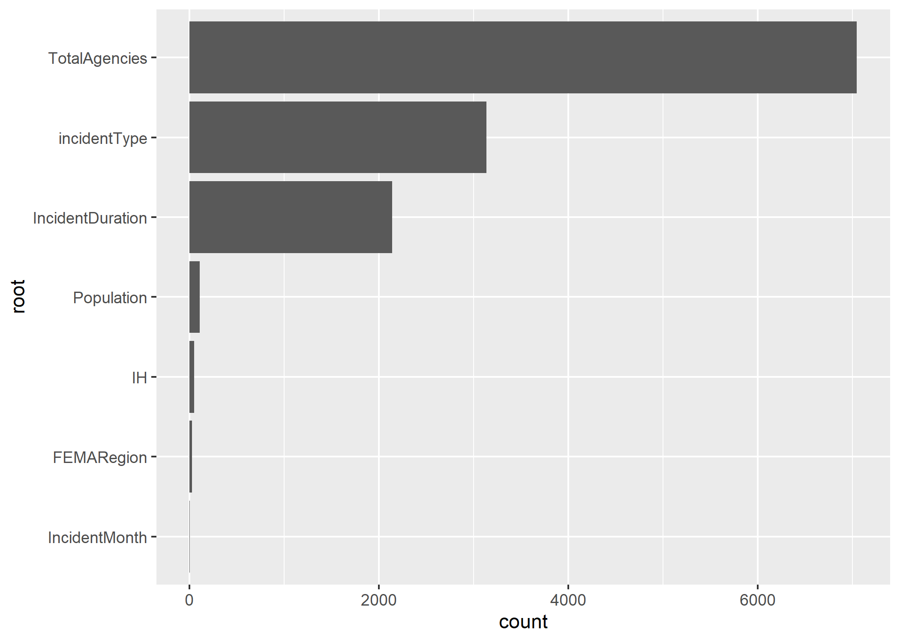
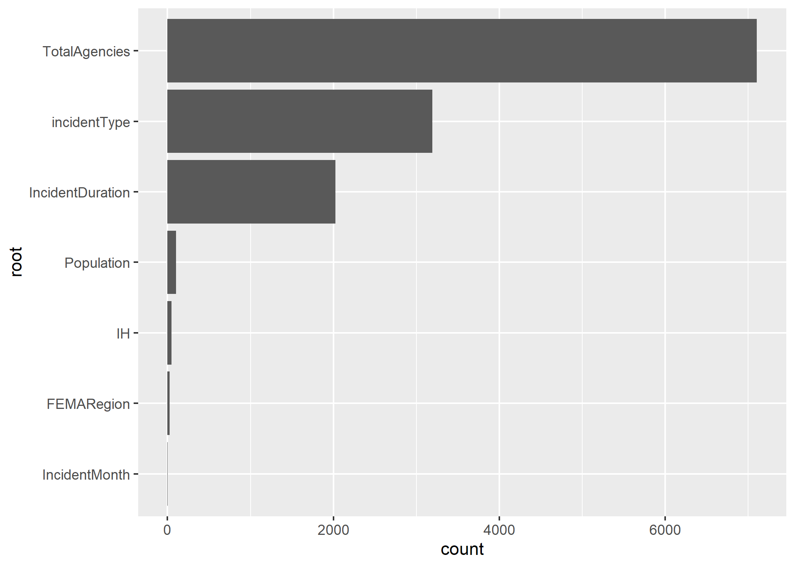

# Summary/Abstract
Rapidly increasing inflation rates and worsening effects of climate change are dramatically increasing the financial impacts of disasters. Within the United States, the Federal Emergency Management Agency (FEMA) is responsible for providing federal resources to support states and territories during the response phase as well as tracking the financial costs. All tiers of government would benefit from knowing which disaster declaration characteristics would change the amount of financial support from FEMA. This analysis utilizes machine learning technology to predict the funds requested by states or territories from FEMA as well as the funds eventually obligated to states or territories from FEMA for a disaster declaration. In particular, three models are considered: decision tree, bagged tree, and random forest. Cross-validation and bootstrap re-sampling structures are utilized, depending on the model, and the fits of the models are evaluated using the root mean square error (RMSE) statistic. The bagged tree model employing bootstrap re-sampling best fit both the requested and obligated fund models; however, future studies should consider other machine learning models as well as further refinement of the tuning parameters for the ones considered in this analysis. The prediction capabilities created by such models have the potential to dramatically improve comprehension of the key factors affecting financial disaster relief support.

# Introduction
On November 8, 1988, United States (US) President Ronald Reagan signed the Robert T. Stafford Disaster Relief and Emergency Act into law, which formalizes the disaster declaration process and specifies the response responsibilities for each tier of government [@moss_stafford_2009]. Under this law, when a disaster occurs, the affected area (local or state representatives) conducts a damage assessment to estimate the amount of support required from the federal government. That assessment goes through the state government to the Federal Emergency Management Agency (FEMA) to the Department of Homeland Security (DHS) to the US President, who ultimately decides whether the affected region should receive an emergency declaration, a major disaster declaration, or neither [@mccarthy_femas_2009]. FEMA then deploys resources from across the federal government to support the disaster region, the volume and type of which depend upon the declaration type. However, the federal government does not necessarily incur all of the cost of these resources. Under most circumstances, this pay structure more accurately reflects a reimbursement model; that is, the states or territories submit requests to the FEMA for reimbursement after the expenses have occurred. However, there is then a reconciliation process by which the total funds a state or territory receives is often different than the original request. The funding process was further refined as part of the Sandy Recovery Improvement Act of 2013 as well as The Disaster Recovery Reform Act of 2019 [@fema_guide_2021]. These laws require FEMA to publicly provide the information regarding federal government resources paid for by state and federal government funds for each disaster declaration. As a result, the OpenFEMA Data Sets website now exists and provides information summarizing disaster declarations and mission assignments. While this has improved the accessible information, little has been done to draw conclusions from these data for predicting the financial impacts of disasters.

It would greatly benefit the federal government to be able to predict the amount of funding required for a disaster based on parameters known at the onset of the incident, as it would allow for improved funds flow and budgeting practices. Moreover, it would benefit states and territories to know which parameters increase the amount of federal government support in the aftermath of a disaster. Modeling approaches that include machine learning algorithms have been demonstrated to have extensive prediction capability for large datasets. As such, this analysis will examine the use of machine learning models in predicting FEMA expenses for a federally-declared disaster. In particular, a decision tree, bagged tree, and random forest model will be used to predict requested and obligated FEMA funds.

## Disaster Declaration Process
When a disaster occurs, the onus for requesting assistance begins at the local government. The local officials must have enacted their own emergency operations plans and demonstrate the need for more resources than the local entities can provide. Once this threshold is crossed, the municipal or county leader submits a formal request to the state governor for assistance by requesting a state disaster declaration [@mccarthy_femas_2009]. If the governor approves such a request, state resources are mobilized to assist the affected area, but the local government is still the primary leading entity for the emergency management response. If the state has fully enacted  their emergency response plans and further assistance is still required, the governor requests the state emergency management agency to conduct a state-level Preliminary Damage Assessment (PDA). These assessments aim to estimate the impact of the disaster on individuals, infrastructure, and government agencies [@moss_stafford_2009]. As federal resources are extraordinarily expensive, state governors utilize PDAs to ensure federal assistance is only requested when absolutely necessary. If the governor does decide that federal resources are required, a formal request is submitted by the governor's office through the regional FEMA office. This request includes the PDA, barring a few exceptional circumstances for catastrophic events, and a list of requested federal resources, including the anticipated duration and cost of each resource [@moss_stafford_2009]. The regional FEMA office ensures the request is complete before sending it to a special declaration processing unit in FEMA headquarters, which further add to the request by incorporating detailed statistics about the region and their own assessment of needs and costs [@mccarthy_femas_2009]. The declaration processing unit then submits the request to the FEMA Administrator, who must make a recommendation for the President. The request and the recommendation are then submitted to the President, who ultimately decides whether or not to grant the declaration request. The President is not bound by the FEMA Administrator's recommendation, and, in the event the President denies the request, the governor is permitted to submit an appeal based on further damage assessments [@moss_stafford_2009]. If the request is approved, FEMA becomes the primary agency to coordinate resource allocation and support the local response. The approval from the President also specifies which programs are authorized as well as the federal/state cost-sharing ratio [@fema_guide_2021].

## Machine Learning Models
There are numerous machine learning models that could be applied to the research question, but this analysis focuses primarily on three different types of tree models. This type of model was chosen as the primary users of the prediction algorithms are non-statisticians, and tree models are among the easiest machine learning models to interpret and understand [@james_introduction_2021].

* Decision Tree (DT): Also known as a classification and regression tree (CART), the DT examines each predictor and splits the outcome at a value of the predictor that leads to the best performance increase in the model. The tree development continues until a certain threshold criteria is met, such as number of observations in each leaf of the tree. A DT model is often the most intuitive machine learning algorithm, but it also typically has a reduced performance compared to other models [@boehmke_hands-machine_2019].

* Bagged Tree (BT): A slightly more sophisticated model, a BT aims to reduce the variance by re-sampling the existing data (otherwise known as bootstrapping) and builds a tree for each sample. The final model then averages all of the individually sampled trees. However, the reducing the variance in the model also reduces the ease of interpretation of the model [@dietterich_experimental_nodate].

* Random Forest (RF): A RF model follows similar principles to the BT, but instead of considering all possible predictors at each decision tree split, the split occurs based on the best predictors of a random sample of all predictors. This method allows for de-correlation in the trees by avoiding the default nature of decision trees that aim to include as many predictors as possible. Each individual tree is then averaged to find the final model. RF models are also more difficult to interpret than standard decision tree models [@breiman_random_2001].

# Materials and Methods

## Data and Processing
The data were obtained from the OpenFEMA Data Sets website [@noauthor_openfema_nodate] as well as the US Department of Agriculture Economic Research Service website [@noauthor_usda_nodate]. The mission assignments data was cleaned to represent the requested and obligated FEMA funds for each disaster declaration for each state or territory. Feature engineering was performed to create summary variables for total number of federal agencies involved in resource assistance, the amount of funding requested by the state or territory from FEMA, the amount of funding allocated to the state or territory from FEMA, and the average cost share for FEMA of the resources provided. Similarly, the disaster declaration summaries were also summarized to represent the unique disaster declarations for each state, bounded to the same time frame as the mission assignments data. Feature engineering was performed to create variables for incident duration, response duration, month of declaration, and year of the incident. The population data from the US Department of Agriculture Economic Research Service was incorporated into the disaster summary data, after creating a variable for state. The mission assignment data and declaration data were then joined to create a comprehensive dataset that was used for analysis.

Prior to fitting the models, the data were subset based on outcome of interest, and some feature engineering was performed. Due to the limited values in certain categories, the state variable was summarized into the ten FEMA regions and the least frequent disaster types were added to the "Other" category. Additionally, the relief provided to Puerto Rico in the aftermath of Hurricane Maria in 2017 was removed as an outlier, as it was more than $2 billion more than the next largest allocation of funding. 

## Model Development
Three models were considered for the prediction analysis: decision tree, bagged tree, and random forest, and each were fit for both outcomes of interest (e.g. requested and obligated funds). The data were split such that 66.7% were used for training the models and the remaining 33.3% were used for testing the final chosen model, stratified by the incident type. Cross-validation was used for the decision tree and random forest models, using a five-fold, five-repeat resampling structure, also stratified by the incident type. The bagged tree model instead implemented a bootstrap resampling structure, repeated ten times, again stratified by the incident type. Incident type was chosen as the stratification variable to address the fact that the frequency of incident types varies across FEMA regions.

## Model Performance Evaluation
The standard metric for evaluating regression models is the root mean square error (RMSE), which is the square root of the mean of the square of all error. It is formally defined as:
$$
RMSE = \sqrt{\frac {1}{n} \sum_{i = 1}^{n}{(S_i - O_i)^2}}
$$
where O_i are the observations, S_i are the predicted values of the outcome, and n is the number of observations in the analysis. RMSE is scale dependent, but the lower the RMSE, the better the model performance.

## Software
This analysis was conducted in Rstudio 4.1 on a Windows Server operating system [@r_core_team_r_2021]. The following R packages were utilized: here, tidyverse, skimr, lubridate, tidymodels, broom.mixed, rpart.plot, vip, glmnet, doParallel, ranger, and baguette. All processing and analysis code can be found in the supplementary materials.

# Results
A total of 446 disaster declarations were included in this analysis, ranging from February 2010 to November 2021. On average, \$29,700,000 (SD = \$219,000,000) were requested and obligated in FEMA funding, with requests ranging from \-$855,000 to $4,390,000,000. All states and territories were represented in the analysis, and on average, the FEMA cost-share was 80.6% (SD = 35.4%). The year 2020 had more than double the average number of disaster declarations, which likely can be attributed to the COVID-19 pandemic. Further information about the distribution of the data can be found in the supplementary documentation.

Three models were fit to predict requested and obligated FEMA funding in the event of a disaster declaration: decision tree, bagged tree, and random forest. Table \@ref(tab:ML-model-comp) shows the model comparison for estimating requested FEMA funding, and Table \@ref(tab:ML-model-comp-obl) similarly shows the model comparisons for estimating obligated FEMA funding. In both outcomes, the bagged tree had the lowest RMSE; however, the standard error estimate of the RMSE was higher in the bagged tree models than for the other models.

```{r ML-model-comp,  echo=FALSE, message = FALSE}
resulttable=readRDS("../../results/ML-model-comp.rds")
knitr::kable(resulttable, caption = 'ML model comparison for requested FEMA funding')
```

```{r ML-model-comp-obl,  echo=FALSE}
resulttable1=readRDS("../../results/ML-model-comp-obl.rds")
knitr::kable(resulttable1, caption = 'ML model comparison for obligated FEMA funding')
```

The bagged tree model was still chosen as the best model of the three, and it was fitted to the testing data sample. Figure \@ref(fig:BT-plot-outlier) shows the identified most important variables in the bagged tree model for requested FEMA funds, and Figure \@ref(fig:BT-plot-obl-outlier) illustrates the identical principle but for obligated FEMA funds. In both models, total number of federal agencies involved, incident type, incident duration, state population, awardance of the individual / household assistance program, and FEMA region were identified as the most important predictors of FEMA funding.

```{r BT-plot-outlier,  fig.cap='Most important variables to predict requested FEMA funds for the bagged tree fit', echo=FALSE}

```

```{r BT-plot-obl-outlier,  fig.cap='Most important variables to predict obligated FEMA funds for the bagged tree fit', echo=FALSE}

```

The RMSEs for the testing and training datasets were substantially different, with an RMSE of 45003235 for the training data and 69378994 for the testing data. Figure \@ref(fig:BT-pred-act-test) shows the predicted and actual requested funds values, and Figure \@ref(fig:BT-pred-act-test-obl) does the same for obligated FEMA funds. The supplementary information contains the code for the models as well as all diagnostic plots.
```{r BT_pred_act_test,  fig.cap='Predicted vs actual requested FEMA funds for the bagged tree fit', echo=FALSE}
knitr::include_graphics("../../results/BT-pred-act-test.png")
```

```{r BT_pred_act_test-obl,  fig.cap='Predicted vs actual obligated FEMA funds for the bagged tree fit', echo=FALSE}
knitr::include_graphics("../../results/BT-pred-act-test-obl.png")
```

# Discussion
In order to identify the most important predictors of requested and obligated FEMA funding in the aftermath of a disaster, three machine learning algorithms were fit to FEMA's disaster declaration data: decision tree, bagged tree, and random forest. Of the three models, the bagged tree model demonstrated the best performance with the lowest RMSE, the identified metric of evaluation. The bagged tree model identified total number of federal agencies involved, incident type, incident duration, state population, awardance of individual / household assistance program, and FEMA region. These variables are relatively expected, as the each of them plays a critical role in FEMA's decision of how much funding to award a state. However, it is interesting the state population is identified as such a critical predictor; it suggests that the number of individuals affected by a disaster plays a crucial role in the President's decision to provide assistance.

While this model does take a measured step towards identifying predictors for FEMA funding, there are a number of limitations to the study. First and foremost, the limited data available about disaster declarations leaves a number of important variables out of the analysis. Aspects such as the number of casualties or damage to critical infrastructure inevitably changes the amount of federal government assistance. However, no such data widely exists for casualties by federal disaster declaration. Moreover, the materials included in the recommendation to the President, such as the PDA, are protected by executive privilege and are therefore unavailable to the public. In order to improve the meaningful nature of these prediction models, such information should be incorporated.

The distribution of federal government funding also provides a limitation to this analysis. The range is extensive, and exploratory results suggest the data follow a logarithmic curve rather than a linear increase. However, as there are disasters where the federal government does not provide any funding, so the state is responsible for covering the cost of federal resources. In these instances, the requested and obligated FEMA funding is reported as a negative cost, which cannot be log-transformed. Future analyses could divide the data into two analyses: one that addresses disasters where the federal government does provide cost-sharing support, and one that addresses disasters where the state provides all funding.

Ultimately, this analysis is the first of its kind to apply prediction algorithms to federal funding for disaster declarations in the United States. It demonstrates the clear potential of such modeling capabilities not only to allow local and state emergency managers to predict which aspects of a PDA are critical in obtaining financial federal relief, but also to allow the regional FEMA offices to identify such predictors while developing the formal requests. Continued research in this area will support emergency managers of all levels in predicting financial disaster relief support.

# References


