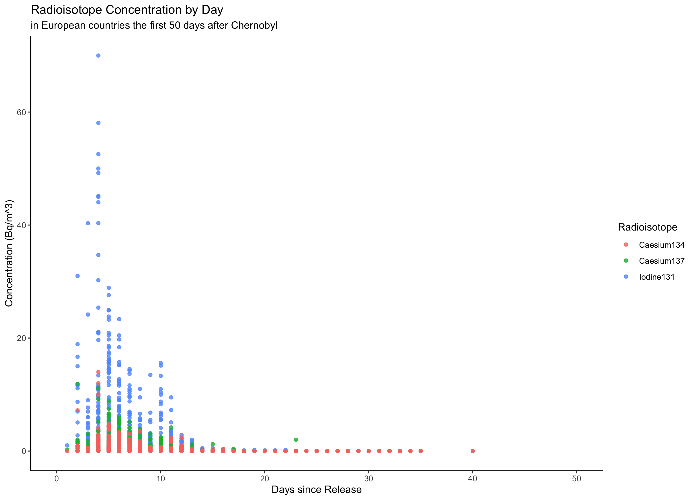
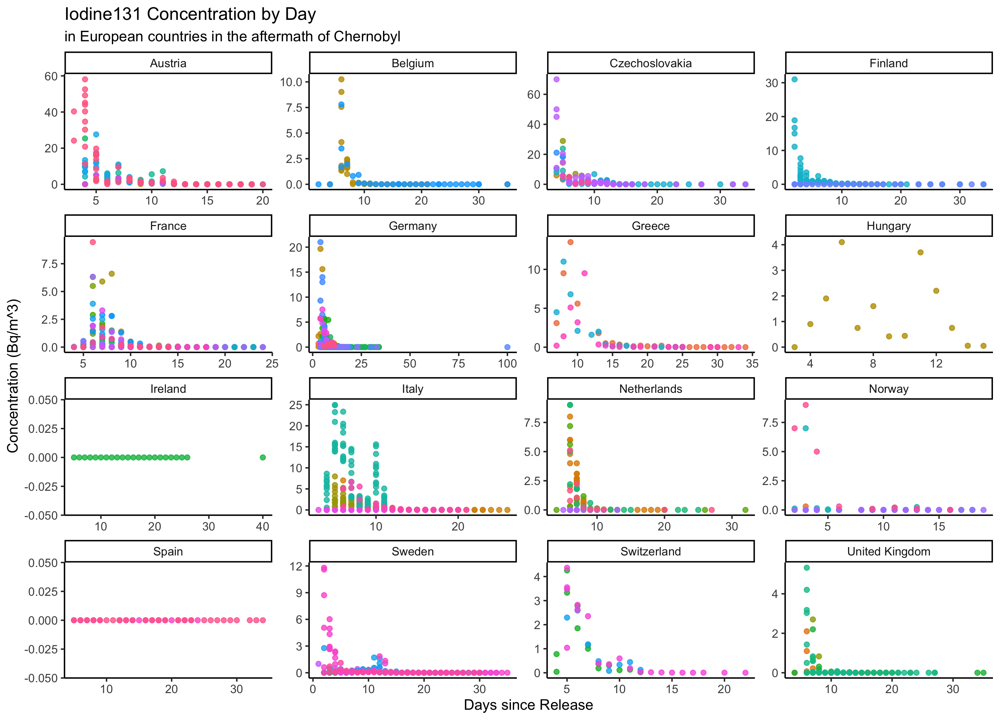
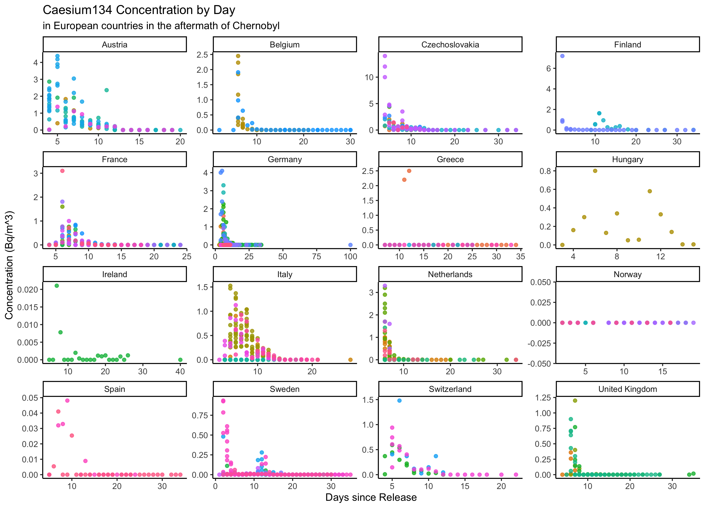
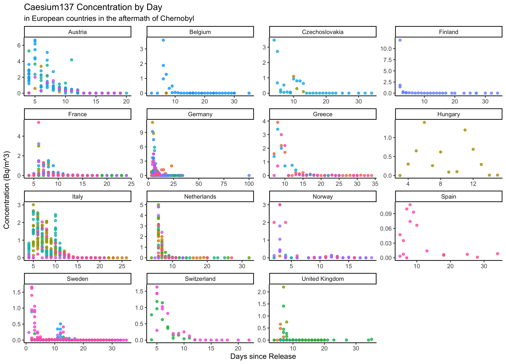

# Summary/Abstract
_Write a summary of your project._

# Introduction 

## General Background Information
_Provide enough background on your topic that others can understand the why and how of your analysis_ 

## Description of data and data source
_Describe what the data is, what it contains, where it is from, etc. Eventually this might be part of a methods section._


## Questions/Hypotheses to be addressed
_State the research questions you plan to answer with this analysis._


The funding process was further refined as part of the Sandy Recovery Improvement Act of 2013 as well as The Disaster Recovery Reform Act of 2019. These laws require FEMA to publicly provide the following information for each mission assignment: 


When disasters occur, one of the most complicated and difficult challenges becomes financing the response and recovery efforts. In 1988, United States (US) President Ronald Reagan signed the Robert T. Stafford Disaster Relief and Emergency Act into law to formalize the financial responsibilities of each tier of US government. Under this law, when a disaster occurs, the affected area (local or state representatives) conducts a damage assessment to estimate the amount of support required from the federal government. That assessment goes through the state government to the Federal Emergency Management Agency (FEMA) to the Department of Homeland Security (DHS) to the US President, who ultimately decides whether the affected region should receive an emergency declaration, a major disaster declaration, or neither. FEMA then deploys resources from across the federal government to support the disaster region, the volume and type of which depend upon the declaration type. However, the federal government does not necessarily incur all of the cost of these resources. Under most circumstances, this pay structure more accurately reflects a reimbursement model; that is, the states or territories submit requests to the FEMA for reimbursement after the expenses have occurred. However, there is then a reconciliation process by which the total funds a state or territory receives is often different than the original request. The accumulation of this process, including characteristics of the incident itself, are extraordinarily complex, and therefore make it difficult to predict the cost and true impact.

Moreover, the combination of rapidly increasing inflation and worsening effects of climate change has caused disasters to become more frequent and devastating on an annual basis, and the financial impacts are becoming increasingly difficult to absorb within the United States (US) government infrastructure. It would greatly benefit the federal government to be able to predict the amount of funding required for a disaster based on parameters known at the onset of the incident, as it would allow for improved funds flow and budgeting practices. Moreover, it would benefit states and territories to know which parameters increase the amount of federal government support in the aftermath of a disaster. As such, this analysis will examine the use of machine learning models in predicting FEMA expenses for a federally-declared disaster. In particular, a decision tree, bagged tree, and random forest model will be used to predict obligated and requested FEMA funds.

# Methods and Results

_In most research papers, results and methods are separate. You can combine them here if you find it easier. You are also welcome to structure things such that those are separate sections._


## Data import and cleaning
_Write code that reads in the file and cleans it so it's ready for analysis. Since this will be fairly long code for most datasets, it might be a good idea to have it in one or several R scripts. If that is the case, explain here briefly what kind of cleaning/processing you do, and provide more details and well documented code somewhere (e.g. as supplement in a paper). All materials, including files that contain code, should be commented well so everyone can follow along._
The data were obtained from the OpenFEMA Data Sets website as well as the US Department of Agriculture Economic Research Service website. The "Mission Assignment" data was cleaned to represent the requested and obligated FEMA funds for each disaster declaration for each state or territory. Feature engineering was performed to create summary variables for total number of federal agencies involved in resource assistance, the amount of funding requested by the state or territory from FEMA, the amount of funding allocated to the state or territory from FEMA, and the average cost share for FEMA of the resources provided. 

The data obtained from the US Department of Agriculture Economic Research was utilized to generate state population estimates and the number of counties per state.

The data summarizing disaster declarations was cleaned to represent the unique declarations per state

## Exploratory analysis

_Use a combination of text/tables/figures to explore and describe your data. You should produce plots or tables or other summary quantities for the most interesting/important quantities in your data. Depending on the total number of variables in your dataset, explore all or some of the others. FIgures produced here might be histograms or density plots, correlation plots, etc. Tables might summarize your data._

_Continue by creating plots or tables of the outcome(s) of interest and the predictor/exposure/input variables you are most interested in. If your dataset is small, you can do that for all variables. Plots produced here can be scatterplots, boxplots, violinplots, etc. Tables can be simple 2x2 tables or larger ones._

_To get some further insight into your data, if reasonable you could compute simple statistics (e.g. t-tests, simple regression model with 1 predictor, etc.) to look for associations between your outcome(s) and each individual predictor variable. Though note that unless you pre-specified the outcome and main exposure, any "p<0.05 means statistical significance" interpretation is not valid._

A total 2,051 observations were included in the original dataset, but 20 were removed for having no concentration recorded for any of the radioisotopes in question. 

Table \@ref(tab:isotope_table) describes the three radioisotopes captured in the data.

```{r isotopetable,  echo=FALSE}
#load data for entire document
#path to data
#note the use of the here() package and not absolute paths
data_location <- here::here("data","processed_data","processeddata.rds")
data_location2 <- here::here("data", "processed_data", "processeddatalong.rds")

#load data
mydata <- readRDS(data_location)
mydata_long <- readRDS(data_location2)

#define row labels
table1::label(mydata$Iodine131) <- "Iodine 131 (Bq/m^3)"
table1::label(mydata$Caesium134) <- "Caesium 134 (Bq/m^3)"
table1::label(mydata$Caesium137) <- "Caesium 137 (Bq/m^3)"

#now combine into table
table1::table1(~ Iodine131 + Caesium134 + Caesium137, data = mydata)
```


Figure \@ref(fig:radioisotopesdays_50) depicts the relationship between the first 50 days after the incident and the measured concentration of each of the three radioisotopes. Radioactive decay is often used as an example of exponential decay; however, this pattern is not represented with this data. This phenomenon can be explained by the fact that fallout radiation instead follows a Poisson distribution pattern, due to the geographical dispersion of the particles.

```{r radioisotopesdays_50,  fig.cap='Radioisotope concentrations in European countries by days after Chernobyl..', echo=FALSE}

```
Fallout radioisotope concentrations were collected from 96 different locations across 96 countries.

Figure \@ref(fig:i131samplelocations) depicts the relationship between time elapsed and the measured concentration of I-131 across the different countries. Figures \@ref(fig:cs134samplelocations) and \@ref(fig:cs137samplelocations) are identical representations but for Cs-134 and Cs-137 respectively.

```{r i131locations,  fig.cap='Concentration of I-131 in European countries by days after Chernobyl.', echo=FALSE}

```

```{r cs134locations,  fig.cap='Concentration of Cs-134 in European countries by days after Chernobyl.', echo=FALSE}

```

```{r cs137locations,  fig.cap='Concentration of Cs-137 in European countries by days after Chernobyl.', echo=FALSE}

```

## Full analysis

_Use one or several suitable statistical/machine learning methods to analyze your data and to produce meaningful figures, tables, etc. This might again be code that is best placed in one or several separate R scripts that need to be well documented. You want the code to produce figures and data ready for display as tables, and save those. Then you load them here._


# Discussion

## Summary and Interpretation
_Summarize what you did, what you found and what it means._

## Strengths and Limitations
_Discuss what you perceive as strengths and limitations of your analysis._

## Conclusions
_What are the main take-home messages?_

_Include citations in your Rmd file using bibtex, the list of references will automatically be placed at the end_

This paper [@Leek2015a] discusses types of analyses. 

Note that this cited reference will show up at the end of the document, the reference formatting is determined by the CSL file specified in the YAML header. Many more style files for almost any journal [are available](https://www.zotero.org/styles). You also specify the location of your bibtex reference file in the YAML. You can call your reference file anything you like, I just used the generic word `references.bib` but giving it a more descriptive name is probably better.


# References


