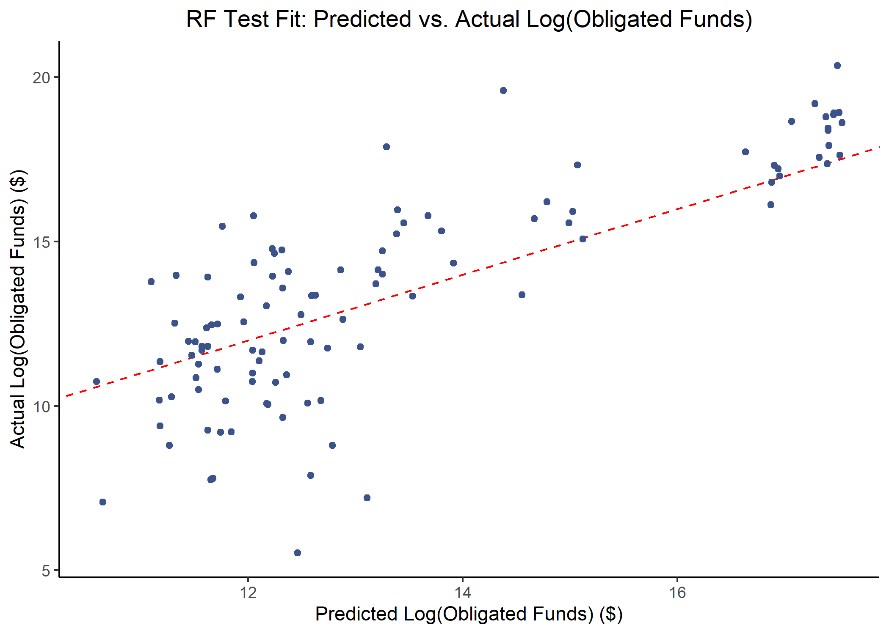

# Summary/Abstract
Rapidly increasing inflation rates and worsening effects of climate change are dramatically increasing the financial impacts of disasters. Within the United States, the Federal Emergency Management Agency (FEMA) is responsible for providing federal resources to support states and territories during the response phase as well as tracking the financial costs. All tiers of government would benefit from knowing which disaster declaration characteristics would change the amount of financial support from FEMA. This analysis utilizes machine learning technology to predict the funds requested by states or territories from FEMA as well as the funds eventually obligated to states or territories from FEMA for a disaster declaration. In particular, three models are considered: decision tree, bagged tree, and random forest. Cross-validation and bootstrap re-sampling structures are utilized, depending on the model, and the fits of the models are evaluated using the root mean square error (RMSE) statistic. The bagged tree model employing bootstrap re-sampling best fit both the requested and obligated fund models; however, future studies should consider other machine learning models as well as further refinement of the tuning parameters for the ones considered in this analysis. The prediction capabilities created by such models have the potential to dramatically improve comprehension of the key factors affecting financial disaster relief support.

# Introduction
On November 8, 1988, United States (US) President Ronald Reagan signed the Robert T. Stafford Disaster Relief and Emergency Act into law, which formalizes the disaster declaration process and specifies the response responsibilities for each tier of government [@mossStaffordActPriorities2009]. Under this law, when a disaster occurs, the affected area (local or state representatives) conducts a damage assessment to estimate the amount of support required from the federal government. That assessment goes through the state government to the Federal Emergency Management Agency (FEMA) to the Department of Homeland Security (DHS) to the US President, who ultimately decides whether the affected region should receive an emergency declaration, a major disaster declaration, or neither [@mccarthyFEMADisasterDeclaration2009]. FEMA then deploys resources from across the federal government to support the disaster region, the volume and type of which depend upon the declaration type. However, the federal government does not necessarily incur all of the cost of these resources. Under most circumstances, this pay structure more accurately reflects a reimbursement model; that is, the states or territories submit requests to the FEMA for reimbursement after the expenses have occurred. However, there is then a reconciliation process by which the total funds a state or territory receives is often different than the original request. This process, explained in greater detail below, involves numerous parameters that are not always obvious to non-FEMA representatives. As such, this analysis endeavors to discern the key predictors for receiving federal funding relief under a disaster declaration.

## Disaster Declaration Process
When a disaster occurs, the onus for requesting assistance begins at the local government. The local officials must have enacted their own emergency operations plans and demonstrate the need for more resources than the local entities can provide. Once this threshold is crossed, the municipal or county leader submits a formal request to the state governor for assistance by requesting a state disaster declaration [@mccarthyFEMADisasterDeclaration2009]. If the governor approves such a request, state resources are mobilized to assist the affected area, but the local government is still the primary leading entity for the emergency management response. If the state has fully enacted  their emergency response plans and further assistance is still required, the governor requests the state emergency management agency to conduct a state-level Preliminary Damage Assessment (PDA). These assessments aim to estimate the impact of the disaster on individuals, infrastructure, and government agencies [@mossStaffordActPriorities2009]. As federal resources are extraordinarily expensive, state governors utilize PDAs to ensure federal assistance is only requested when absolutely necessary. If the governor does decide that federal resources are required, a formal request is submitted by the governor's office through the regional FEMA office. This request includes the PDA, barring a few exceptional circumstances for catastrophic events, and a list of requested federal resources, including the anticipated duration and cost of each resource [@mossStaffordActPriorities2009]. The regional FEMA office ensures the request is complete before sending it to a special declaration processing unit in FEMA headquarters, which further add to the request by incorporating detailed statistics about the region and their own assessment of needs and costs [@mccarthyFEMADisasterDeclaration2009]. The declaration processing unit then submits the request to the FEMA Administrator, who must make a recommendation for the President. The request and the recommendation are then submitted to the President, who ultimately decides whether or not to grant the declaration request. The President is not bound by the FEMA Administrator's recommendation, and, in the event the President denies the request, the governor is permitted to submit an appeal based on further damage assessments [@mossStaffordActPriorities2009]. If the request is approved, FEMA becomes the primary agency to coordinate resource allocation and support the local response. The approval from the President also specifies which programs are authorized as well as the federal/state cost-sharing ratio [@femaGuideDisasterDeclaration2021].

## Newly Available Data
The federal government funding process was further refined as part of the Sandy Recovery Improvement Act of 2013 as well as The Disaster Recovery Reform Act of 2019 [@femaGuideDisasterDeclaration2021]. These laws require FEMA to publicly provide the information regarding federal government resources paid for by state and federal government funds for each disaster declaration. As a result, the OpenFEMA Data Sets website now exists and provides information summarizing disaster declarations and mission assignments. While these acts have improved the accessible information, little has been done to draw conclusions from these data for predicting the financial impacts of disasters. Due to the federal government legislative process, these datasets have been publicly available for less than two years, during which the preponderance of the emergency management community was dedicated to managing the COVID-19 pandemic. To date, there is one published paper using predictive modeling to examine disaster declarations; however, it is only published in Spanish, and the authors do not have a reliable means of translation [@araujoperezPredictiveModelsDisaster2019]. Based on an approximate translation, the authors used a logistic regression to predict whether or not a presidential declaration would be awarded in the state of Maryland, utilizing Maryland data 2003 - 2017 [@araujoperezPredictiveModelsDisaster2019]. Given this newly available data from the federal government, there are numerous potential predictive models to be considered.

It would greatly benefit the federal government to be able to predict the amount of funding required for a disaster based on parameters known at the onset of the incident, as it would allow for improved funds flow and budgeting practices. Moreover, it would benefit states and territories to know which parameters increase the amount of federal government support in the aftermath of a disaster. Modeling approaches that include machine learning algorithms have been demonstrated to have extensive prediction capability for large datasets. As such, this analysis will examine the use of machine learning models in predicting FEMA expenses for a federally-declared disaster. In particular, a decision tree, bagged tree, and random forest model will be used to predict requested and obligated FEMA funds.

# Materials and Methods

## Data and Processing
The data were obtained from the OpenFEMA Data Sets website [@OpenFEMADataSets] as well as the US Department of Agriculture Economic Research Service website [@USDAERSCountylevel]. The mission assignments data was cleaned to represent the requested and obligated FEMA funds for each disaster declaration for each state or territory. Summary variables were created for total number of federal agencies involved in resource assistance, the amount of funding requested by the state or territory from FEMA, the amount of funding allocated to the state or territory from FEMA, and the average cost share for FEMA of the resources provided. Similarly, the disaster declaration summaries were also summarized to represent the unique disaster declarations for each state, bounded to the same time frame as the mission assignments data. Feature engineering was performed to create variables for incident duration, response duration, month of declaration, and year of the incident. The population data from the US Department of Agriculture Economic Research Service was incorporated into the disaster summary data, after creating a variable for state. The mission assignment data and declaration data were then joined to create a comprehensive dataset that was used for analysis. At this point in the analysis, Google developer data [@googledeveloperStatesCsvDataset] was added to specify coordinates of each date, and the outcomes of interest were subset to include only circumstances in which the federal government provided funding (e.g. only positive requested or obligated amounts). 

Prior to fitting the models, the data were subset based on outcome of interest, and the least frequent disaster types were added to the "Other" category, due to the limited values in certain categories. The outcomes of interest were also log transformed to better represent the distribution of disaster relief funding. At this point, three outliers were removed from the analysis, as each had a negative value of the log transform of the outcomes of interest.

## Parameters Considered
Ultimately, the following parameters were considered in the analysis: state, longitude/latitude of state, state population, state number of counties, the FEMA Region to which the state belonged, declaration type, month and year of the first date of the event, duration of the incident, duration of the response efforts, when the Individual/Household, Public Assistance, and Hazard Mitigation Programs were awarded to any county in the state as well as the percent of counties receiving each program, number of federal agencies involved in the response, and the average FEMA cost share for the resources provided to the state under the declaration.

## Model Development
Four models were considered for the prediction analysis, and each were fit for both outcomes of interest (e.g. requested and obligated funds). The data were split such that 66.7% were used for training the models and the remaining 33.3% were used for testing the final chosen model. Spatial cross-validation was used for all models, using a five-fold resampling structure. The tidymodels framework utilized in the analysis does not support a repreated spatial cross-validation resampling structure, as is standard in typical cross-validation.

## Model Definition
There are numerous machine learning models that could be applied to the research question, but this analysis focuses primarily on two different types of models: tree-based and regularization-based. The tree-based models were chosen as the primary users of the prediction algorithms are non-statisticians, and such models are among the easiest machine learning models to interpret and understand [@jamesIntroductionStatisticalLearning2021]. However, to robustly consider the machine learning methodology, two regularization-based methods were also included in the analysis. Broadly, regularization allows variables to be included in a model with less weight than other variables by reducing the value of the variable's coefficient [@hastieElementsStatisticalLearning2016].

* Decision Tree (DT): Also known as a classification and regression tree (CART), the DT examines each predictor and splits the outcome at a value of the predictor that leads to the best performance increase in the model. The tree development continues until a certain threshold criteria is met, such as number of observations in each leaf of the tree. A DT model is often the most intuitive machine learning algorithm, but it also typically has a reduced performance compared to other models [@boehmkeHandsOnMachineLearning2019].

* Random Forest (RF): A slightly more sophisticated model, a RF model aims to reduce the variance by building a tree for each re-sampling of the existing data. However, instead of considering all possible predictors at each decision tree split, the split occurs based on the best predictors of a random sample of all predictors. This method allows for de-correlation in the trees by avoiding the default nature of decision trees that aim to include as many predictors as possible. Each individual tree is then averaged to find the final model. RF models are also more difficult to interpret than standard decision tree models [@breimanRandomForests2001].

* Least Absolute Shrinkage and Selection Operator (LASSO): LASSO balances the goodness of fit with a penalty for the coefficients, calculated by the respective absolute value. This methodology allows coefficients to go to zero and thus be dropped from the model. The disadvantage of the LASSO model comes predominantly in the form of selection of just one variable from highly correlated variables, ignoring the rest entirely [@rothGeneralizedLASSO2004].

* Elastic Net (EN): Of particular use in circumstances with correlations between predictor variables, an EN model further adds to a LASSO model by incorporating a mixture parameter in addition to the overall weight given of the penalty. The mixture parameter determines the distribution of the penalty, which is the sum of the LASSO regularization component as well as a new regularization component, which is calculated by squaring the magnitude of the coefficient, and then all coefficients are shrunk by the same factor [@zouRegularizationVariableSelection2005].

## Model Performance Evaluation
The standard metric for evaluating regression models is the root mean square error (RMSE), which is the square root of the mean of the square of all error. It is formally defined as:
$$
RMSE = \sqrt{\frac {1}{n} \sum_{i = 1}^{n}{(S_i - O_i)^2}}
$$
where O<sub>i</sub> are the observations, S<sub>i</sub> are the predicted values of the outcome, and n is the number of observations in the analysis. RMSE is scale dependent, but the lower the RMSE, the better the model performance.

## Software
This analysis was conducted in R 1.4, using Rstudio 4.1 on a Windows Server operating system [@rcoreteamLanguageEnvironmentStatistical2021]. The following R packages were utilized: here [@here], tidyverse [@tidyverse], tidymodels [@tidymodels], skimr [@skimr], spatialsample [@spatialsample], broom.mixed [@broommixed], rpart.plot [@rpartplot], vip [@vip], doParallel [@doParallel], ranger [@ranger], viridis [@viridis], maps [@maps], table1 [@table1], cowplot [@cowplot], scales [@scales], gtsummary [@gtsummary], car [@car], ggplot2 [@ggplot2], and summarytools [@summarytools]. All processing and analysis code can be found in the supplementary materials.

# Results

## Outcomes of Interest
A total 3266 disaster declarations were included in this analysis, ranging from February 2012 to November 2021. On average, \$40,600,000 (SD = \$255,000,000) were requested in FEMA funding, and \$40,700,000 (SD = \$256,000,000) were obligated in FEMA funding. A total 51 states and territories were represented in the analysis, and on average, the FEMA cost-share was 96.4% (SD = 5.73%). Figure \@ref(fig:funds-density) shows the almost identical density distribution of the two outcomes of interest, which is further confirmed by the correlation plot between the two shown in figure \@ref(fig:funds-comp). 

```{r funds-density,  fig.cap='Density distribution of outcomes of interest', echo=FALSE}

```

```{r funds-comp,  fig.cap='Requested vs obligated FEMA funds provided to states or territories 2012 - 2021', echo=FALSE}

```

Figures \@ref(fig:map3) and \@ref(fig:map4) display the total amount of FEMA funding requested and obligated respectively to each state during the study period. Figure \@ref(fig:map2) further elucidates the role of states, as it shows the total number of declarations each state received during the study period.

```{r map3,  fig.cap='FEMA funds requested by mainland US states 2012 - 2021', echo=FALSE}

```

```{r map4,  fig.cap='FEMA funds obligated to mainland US states 2012 - 2021', echo=FALSE}

```

```{r map2,  fig.cap='Total number of federal disaster declarations to mainland US states 2012 - 2021', echo=FALSE}

```

Further information about the distribution of the covariates considered in this analysis can be found in the supplementary documentation.

## Machine Learning Models

Four models were fit to predict requested and obligated FEMA funding in the event of a disaster declaration: decision tree, random forest, LASSO, and elastic net. 

Table \@ref(tab:ML-model-comp) shows the model comparison for estimating requested FEMA funding, and Table \@ref(tab:ML-model-comp-obl) similarly shows the model comparisons for estimating obligated FEMA funding. In the requested funding outcome, the random forest model had the lowest RMSE, while the obligated funding outcome model identified the decision tree as the model with the lowest RMSE. However, as the difference between the two metrics was <0.05, for the purposes of interpretation, we will choose the random forest model as the most appropriate for both outcomes.

```{r ML-model-comp,  echo=FALSE, message = FALSE}
resulttable=readRDS("../../results/ML-model-comp-outlier.rds")
knitr::kable(resulttable, caption = 'ML model comparison for requested FEMA funding')
```

```{r ML-model-comp-obl,  echo=FALSE}
resulttable1=readRDS("../../results/ML-model-comp-OA-outlier.rds")
knitr::kable(resulttable1, caption = 'ML model comparison for obligated FEMA funding')
```

Figure \@ref(fig:RF-plot-outlier) shows the identified most important variables in the random forest model for requested FEMA funds, and Figure \@ref(fig:RF-plot-OA-outlier) illustrates the identical principle but for obligated FEMA funds. In both models, percent of state counties awarded the Individual/Households program, total number of federal agencies involved in the response, percent of state counties awarded the Hazard Mitigation program, the FEMA cost share average for federal resources provided to the state, and whether or not the Individual/Households program was awarded to any part of the state were identified as the five most important predictors for requesting or receving FEMA funding in the aftermath of a disaster declaration.

```{r RF-plot-outlier,  fig.cap='Most important variables to predict requested FEMA funds for the random forest fit', echo=FALSE}
knitr::include_graphics("../../results/RF-plot-outlier.png")
```

```{r RF-plot-OA-outlier,  fig.cap='Most important variables to predict obligated FEMA funds for the random forest fit', echo=FALSE}
knitr::include_graphics("../../results/RF-plot-OA-outlier.png")
```

To examine the fit of the model to the training data, the following diagnostic plots were generated. Figure \@ref(fig:RF-pred-act-outlier) displays the actual versus predicted values of the log(Requested FEMA Funds), Figure \@ref(fig:RF-resid-outlier) depicts the residuals, and Figure \@ref(fig:RF-pred-resid-outlier) illustrates residuals in comparison to the fitted values of the outcome of interest in the model.

```{r RF-pred-act-outlier,  fig.cap='Actual vs predicted log(requested FEMA funds) for the random forest model', echo=FALSE}

```

```{r RF-resid-outlier,  fig.cap='Requested FEMA funds residuals for the random forest model', echo=FALSE}

```

```{r RF-pred-resid-outlier,  fig.cap='Residuals versus fitted values of the log(requested FEMA funds) for the random forest model', echo=FALSE}

```

Figures \@ref(fig:RF-pred-act-OA-outlier), \@ref(fig:RF-resid-OA-outlier), and \@ref(fig:RF-pred-resid-OA-outlier) generate the same plots as described above, but for obligated FEMA funds.

```{r RF-pred-act-OA-outlier,  fig.cap='Actual vs predicted log(obligated FEMA funds) for the random forest model', echo=FALSE}

```

```{r RF-resid-OA-outlier,  fig.cap='Obligated FEMA funds residuals for the random forest model', echo=FALSE}

```

```{r RF-pred-resid-OA-outlier,  fig.cap='Residuals versus fitted values of the log(obligated FEMA funds) for the random forest model', echo=FALSE}

```

Following selection of the random forest model, it was fitted to the testing data sample. The RMSEs for the testing and training datasets were different for both outcomes, as shown by Tables \@ref(tab:test-train-model-comp-outlier) and \@ref(tab:test-train-model-comp-OA-outlier). In both models, the RMSE for the testing data was lower than for the training data.

```{r TTmodelcomp,  echo=FALSE, message = FALSE}
readRDS("../../results/test-train-model-comp-outlier.rds")
```

```{r TTmodelcompOA,  echo=FALSE, message = FALSE}
readRDS("../../results/test-train-model-comp-OA-outlier.Rds")
```

```{r test-train-model-comp-outlier,  echo=FALSE, message = FALSE}
resulttable=readRDS("../../results/test-train-model-comp-outlier.rds")
knitr::kable(resulttable, caption = 'Random Forest model comparison for test/train data for requested FEMA funding')
```

```{r test-train-model-comp-OA-outlier,  echo=FALSE}
resulttable1=readRDS("../../results/test-train-model-comp-OA-outlier.rds")
knitr::kable(resulttable1, caption = 'Random Forest model comparison for test/train data for obligated FEMA funding')
```


Figure \@ref(fig:RF-pred-act-test-outlier) shows the predicted and actual requested funds values, and Figure \@ref(fig:RF-pred-act-test-OA-outlier) does the same for obligated FEMA funds. The supplementary information contains the code for the models as well as further diagnostic plots.
```{r RF-pred-act-test-outlier,  fig.cap='Predicted vs actual requested FEMA funds for the random forest fit', echo=FALSE}
knitr::include_graphics("../../results/RF-pred-act-test-outlier.png")
```

```{r RF-pred-act-test-OA-outlier,  fig.cap='Predicted vs actual obligated FEMA funds for the random forest fit', echo=FALSE}

```

# Discussion
In order to identify the most important predictors of requested and obligated FEMA funding in the aftermath of a disaster, four machine learning algorithms were fit to FEMA's disaster declaration data: decision tree, random forest, LASSO, and elastic net. Of the four models, the random forest model demonstrated the best performance with the lowest RMSE, the identified metric of evaluation. The random forest model identified percent of state counties awarded the Individual/Households program, total number of federal agencies involved in the response, percent of state counties awarded the Hazard Mitigation program, the FEMA cost share average for federal resources provided to the state, and whether or not the Individual/Households program was awarded to any part of the state were identified as the five most important predictors. These variables are relatively expected, as the each of them plays a critical role in FEMA's decision of how much funding to award a state. However, it is interesting that the incident month and incident year were identified as more important that other factors, such as average FEMA cost share, incident type, or declaration type. It is possible that the year effect may be due to inflation, while the month may be skewed by hazards such as the COVID-19 pandemic or major hurricanes.

The diagnostic plots generated for both the training and testing data fits suggest further attenuation of the model is required to accurately describe funding for presidential declarations. The residual plots do suggest a relatively even distribution, but Figures \@ref(fig:RF-pred-resid-outlier) and \@ref(fig:RF-pred-resid-OA-outlier) in particular suggest the random forest model does not comprehensively describe the data. There appears to be some underlying factor that is affecting the distribution of residuals against the fitted values of the model. As discussed below, further research is warranted to understand this behavior.

While this model does take a measured step towards identifying predictors for FEMA funding, there are a number of limitations to the study. First and foremost, the limited data available about disaster declarations leaves a number of important variables out of the analysis. Aspects such as the number of casualties or damage to critical infrastructure inevitably changes the amount of federal government assistance. However, no such data widely exists for casualties by federal disaster declaration. Moreover, the materials included in the recommendation to the President, such as the PDA, are protected by executive privilege and are therefore unavailable to the public. In order to improve the meaningful nature of these prediction models, such information should be incorporated.

The distribution of federal government funding also provides a limitation to this analysis. The range is extensive, and exploratory results suggest the data follow a logarithmic curve rather than a linear increase. However, as there are disasters where the federal government does not provide any funding, so the state is responsible for covering the cost of federal resources. In these instances, the requested and obligated FEMA funding is reported as a negative cost, which cannot be log-transformed. Future analyses could divide the data into two analyses: one that addresses disasters where the federal government does provide cost-sharing support, and one that addresses disasters where the state provides all funding.

Ultimately, this analysis is the first of its kind to apply such prediction algorithms to federal funding for disaster declarations in the United States. It demonstrates the clear potential of such modeling capabilities not only to allow local and state emergency managers to predict which aspects of a PDA are critical in obtaining financial federal relief, but also to allow the regional FEMA offices to identify such predictors while developing the formal requests. Continued research in this area will support emergency managers of all levels in predicting financial disaster relief support.

# References


