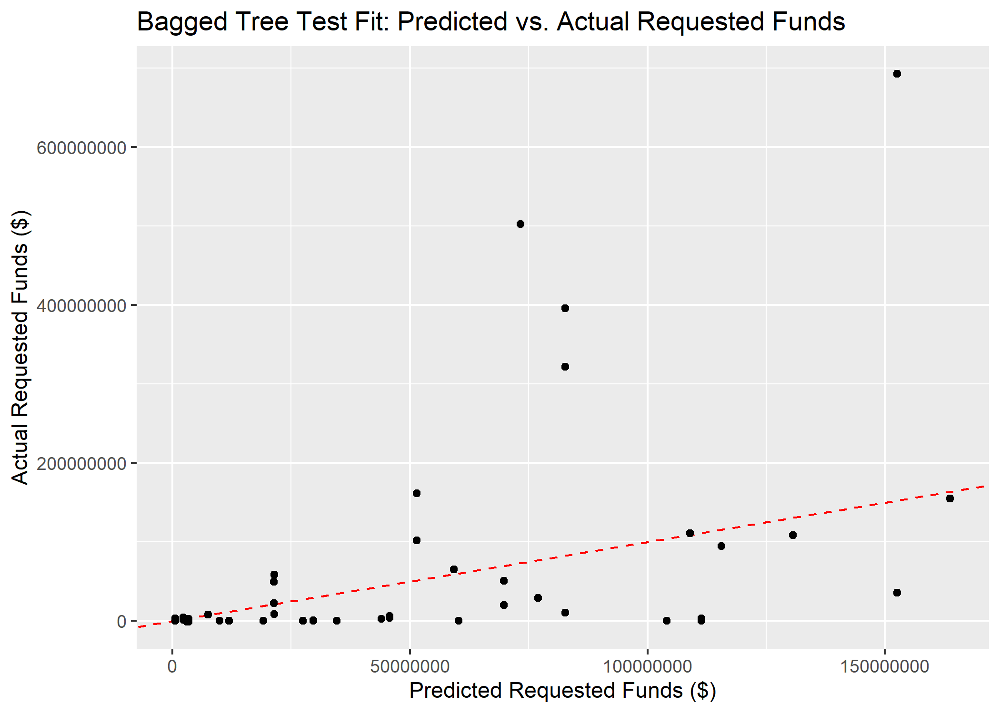

# Summary/Abstract
Rapidly increasing inflation rates and worsening effects of climate change are dramatically increasing the financial impacts of disasters. Within the United States, the Federal Emergency Management Agency (FEMA) is responsible for providing federal resources to support states and territories during the response phase as well as tracking the financial costs. All tiers of government would benefit from knowing which disaster declaration characteristics would change the amount of financial support from FEMA. This analysis utilizes machine learning technology to predict the funds requested by states or territories from FEMA as well as the funds eventually obligated to states or territories from FEMA for a disaster declaration. In particular, three models are considered: decision tree, bagged tree, and random forest. Cross-validation and bootstrap resampling structures are utilized, depending on the model, and the fits of the models are evaluated using the root mean square error (RMSE) statistic. The bagged tree model employing bootstrap resampling best fit both the requested and obligated fund models; however, future studies should consider other machine learning models as well as further refinement of the tuning paramters for the ones considered in this analysis. The prediction capabilities created by such models have the potential to dramatically improve comprehension of the key factors affecting financial disaster relief support. [@federal_emergency_management_agency_guide_2021]

# Introduction 

On November 8, 1988, United States (US) President Ronald Reagan signed the Robert T. Stafford Disaster Relief and Emergency Act into law, which formalizes the disaster declaration process and specifies the response responsibilities for each tier of government. Under this law, when a disaster occurs, the affected area (local or state representatives) conducts a damage assessment to estimate the amount of support required from the federal government. That assessment goes through the state government to the Federal Emergency Management Agency (FEMA) to the Department of Homeland Security (DHS) to the US President, who ultimately decides whether the affected region should receive an emergency declaration, a major disaster declaration, or neither. FEMA then deploys resources from across the federal government to support the disaster region, the volume and type of which depend upon the declaration type. However, the federal government does not necessarily incur all of the cost of these resources. Under most circumstances, this pay structure more accurately reflects a reimbursement model; that is, the states or territories submit requests to the FEMA for reimbursement after the expenses have occurred. However, there is then a reconciliation process by which the total funds a state or territory receives is often different than the original request. The funding process was further refined as part of the Sandy Recovery Improvement Act of 2013 as well as The Disaster Recovery Reform Act of 2019. These laws require FEMA to publicly provide the information regarding federal government resources paid for by state and federal government funds for each disaster declaration. As a result, the OpenFEMA Data Sets website now exists and provides information summarizing disaster declarations and mission assignments. While this has improved the accessible information, little has been done to draw conclusions from these data for predicting the financial impacts of disasters.

It would greatly benefit the federal government to be able to predict the amount of funding required for a disaster based on parameters known at the onset of the incident, as it would allow for improved funds flow and budgeting practices. Moreover, it would benefit states and territories to know which parameters increase the amount of federal government support in the aftermath of a disaster. As such, this analysis will examine the use of machine learning models in predicting FEMA expenses for a federally-declared disaster. In particular, a decision tree, bagged tree, and random forest model will be used to predict requested and obligated FEMA funds.

# Methods and Results

_In most research papers, results and methods are separate. You can combine them here if you find it easier. You are also welcome to structure things such that those are separate sections._


## Data import and cleaning
The data were obtained from the OpenFEMA Data Sets website as well as the US Department of Agriculture Economic Research Service website. The mission assignments data was cleaned to represent the requested and obligated FEMA funds for each disaster declaration for each state or territory. Feature engineering was performed to create summary variables for total number of federal agencies involved in resource assistance, the amount of funding requested by the state or territory from FEMA, the amount of funding allocated to the state or territory from FEMA, and the average cost share for FEMA of the resources provided. Similarly, the disaster declaration summaries were also summarized to represent the unique disaster declarations for each state, bounded to the same time frame as the mission assignments data. Feature engineering was performed to create variables for incident duration, response duration, month of declaration, and year of the incident. The population data from the US Department of Agriculture Economic Research Service was incorporated into the disaster summary data, after creating a variable for state. The mission assignment data and declaration data were then joined to create a comprehensive dataset that was used for analysis. The supplementary files contain the RStudio 4.1 code used to process the data. The following R packages were utilized for importing and cleaning the data: here, tidyverse, skimr, and lubridate.

## Exploratory analysis
The processed data were then explored to characterize and summarize the relevant features in RStudio 4.1 with the following packages: here, tidyverse, skimr, summarytools, ggplot2, car, gtsummary, scales, cowplot, and table1. The supplementary files contain the code that generates the following results.


Table \@ref(tab:table1) reflects the results of the exploratory data analysis. Between February 2012 and November 2021, there were 446 disaster declarations for states and territories. Funds requested by states or territories for FEMA ranged from -\$855,200.3 to \$4,388,540,486, with an average of \$29,673,687, and FEMA funds obligated to the states and territories after reconciliation ranged from -\$855,200.3 to \$440,842,4297 with an average of \$29,744,109. 

```{r summarytable,  echo=FALSE, message = FALSE}
readRDS("../../results/table1.rds")
```


Figure \@ref(fig:incidentyears) shows the number of disaster declarations per year, and Figure \@ref(fig:funds-years) shows the total FEMA funds (both requested and obligated) by states per year. The substantial peak in 2020 corresponds to the COVID-19 pandemic, and the one in 2017 represents the hurricane season with Hurricanes Irma, Harvey, and Maria. These characteristics can also be seen in Table \@ref(tab:decs-year-3), which represents FEMA Funding for the 3 Costliest Years (2012 - 2021).

```{r incidentyears,  fig.cap='Number of disaster declarations per year 2012 - 2021', echo=FALSE, message = FALSE}
knitr::include_graphics("../../results/incidentyear.png")
```

```{r funds-years,  fig.cap='State or territory requested FEMA funds and obligated FEMA funds by year 2012 - 2021', echo=FALSE, message = FALSE}
knitr::include_graphics("../../results/funds-years.png")
```

```{r decs-year-3,  echo=FALSE, message = FALSE}
readRDS("../../results/decs-year-3.Rds")
```


Figure \@ref(fig:incidentmonth) shows the number of disaster declarations per month, and Figure \@ref(fig:funds-month) shows the total FEMA funds (both requested and obligated) by states per month. The substantial peak in January likely corresponds to the COVID-19 pandemic, and the ones in August, September, and October represent the peak hurricane season. These characteristics can also be seen in Table \@ref(tab:decs-month-3), which represents FEMA Funding for the 3 Costliest Months.

```{r incidentmonth,  fig.cap='Number of disaster declarations per month for years 2012 - 2021', echo=FALSE}
knitr::include_graphics("../../results/incidentmonth.png")
```

```{r funds-month,  fig.cap='State or territory requested FEMA funds and obligated FEMA funds by month for 2012 - 2021', echo=FALSE}
knitr::include_graphics("../../results/funds-month.png")
```

```{r decs-month-3,  echo=FALSE, message = FALSE}
readRDS("../../results/decs-month-3.Rds")
```

All 50 states as well as Washington, DC were included in the final, combined dataset. Table \@ref(tab:decs-state-5) provides the five most disaster-prone states and summarizes their requested FEMA funding and received FEMA funding over the study period.
```{r decs-state-5,  echo=FALSE, message = FALSE}
readRDS("../../results/decs-state-5.Rds")
```

Incident duration ranged from zero days to 660 days (or almost two years), as seen by Figure \@ref(fig:funds-dur). The incident duration of 660 days likely corresponds to the COVID-19 pandemic, which is an ongoing incident of almost two years. Further analysis of all variables can be found in the supplementary information.

```{r funds-dur,  fig.cap='Incident duration for requested FEMA funds and obligated FEMA funds under $1 billion for 2012 - 2021', echo=FALSE}
knitr::include_graphics("../../results/funds-dur.png")
```

Prior to fitting the data to machine learning models, standard simple and multivariable regression models were fitted using the tidymodels framework in RStudio 4.1. Both outcomes of interest were fitted, using incident duration as the primary predictor of interest. Figure \@ref(fig:req_MVR_bp) and \@ref(fig:obl_MVR_bp) show the significant variables fitted in the multivariable regression models for requested and obligated FEMA funds, respectively.

```{r req_MVR_bp,  fig.cap='Significant predictors in multivariate regression model for requested FEMA funds', echo=FALSE}
knitr::include_graphics("../../results/req_MVR_bp.png")
```

```{r obl_MVR_bp,  fig.cap='Significant predictors in multivariate regression model for obligated FEMA funds', echo=FALSE}

```


Table \@ref(tab:lm-eval) shows the comparisons of the models, using the root mean square error (RMSE) and r-squared statistics. The requested and obligated funding models performed almost identically. None of the models fit the data well, which suggests more sophisticated modeling practices are necessary to adequately characterize the data.

```{r lm-eval,  echo=FALSE, message = FALSE}
resulttable2=readRDS("../../results/lm-eval.rds")
knitr::kable(resulttable2, caption = 'Linear model comparisons')
```


## Full analysis

_Use one or several suitable statistical/machine learning methods to analyze your data and to produce meaningful figures, tables, etc. This might again be code that is best placed in one or several separate R scripts that need to be well documented. You want the code to produce figures and data ready for display as tables, and save those. Then you load them here._

Three models were considered for the prediction analysis: decision tree, bagged tree, and random forest, and each were fit for both outcomes of interest (e.g. requested and obligated funds). Prior to fitting the models, the data were subset based on outcome of interest, and some feature engineering was performed. Due to the limited values in certain categories, the state variable was summarized into the ten FEMA regions and the least frequent disaster types were added to the "Other" category. The data were split such that 66.7% were used for training the models and the remaining 33.3% were used for testing the final chosen model, stratified by the incident type. Cross-validation was used for the decision tree and random forest models, using a five-fold, five-repeat resampling structure, also stratified by the incident type. The bagged tree model instead implemented a bootstrap resampling structure, repeated ten times, again stratified by the incident type. The models were then compared based on the root mean square error (RMSE), the standard metric for regression models. The analysis was completed in RStudio 4.1 with the following packages: here, tidyverse, tidymodels, skmir, broom.mixed, rpart.plot, vip, glmnet, doParallel, ranger, and baguette.

The identified decision tree model for each outcome is illustrated by Figures  \@ref(fig:DT-plot) and  \@ref(fig:DT-plot-obl). Both outcomes identified the same decision point features: total number of federal agencies involved in the response, duration of the incident, state population, state counties, and whether the individual / housing assistance program was awarded.

```{r DT-plot,  fig.cap='Selected decision tree for predicting requested FEMA funds', echo=FALSE}
knitr::include_graphics("../../results/DT-plot.png")
```

```{r DT-plot-obl,  fig.cap='Selected decision tree for predicting obligated FEMA funds', echo=FALSE}
knitr::include_graphics("../../results/DT-plot-obl")
```

The most important variables in the identified random forest model for each outcome is illustrated by Figures  \@ref(fig:RF-plot) and  \@ref(fig:RF-plot-obl). Both outcomes identified the same important features: incident duration, total number of agencies involved, individual/housing assistance program awardance, and incident month. Interestingly, however, the obligated funds model includes days of the entire response as the fifth most important feature, whereas the requested funds model includes it as the eleventh most important feature. Unfortunately, the tidymodels framework does not support visualization of the bagged tree model.

```{r RF-plot,  fig.cap='20 most important variables for the random forest model for requested FEMA funds', echo=FALSE}
knitr::include_graphics("../../results/RF-plot.png")
```

```{r RF-plot-obl,  fig.cap='20 most important variables for the random forest model for obligated FEMA funds', echo=FALSE}
knitr::include_graphics("../../results/RF-plot-obl")
```

Table \@ref(tab:ML-model-comp) shows the model comparisons for estimating requested FEMA funding, and Table \@ref(tab:ML-model-comp-obl) similarly shows the model comparisons for estimating obligated FEMA funding. In both outcomes, the bagged tree had the lowest RMSE; however, the standard error estimate of the RMSE was higher in the bagged tree models than for the other models.

```{r ML-model-comp,  echo=FALSE, message = FALSE}
resulttable=readRDS("../../results/ML-model-comp.rds")
knitr::kable(resulttable, caption = 'ML model comparison for requested FEMA funding')
```

```{r ML-model-comp-obl,  echo=FALSE}
resulttable1=readRDS("../../results/ML-model-comp-obl.rds")
knitr::kable(resulttable1, caption = 'ML model comparison for obligated FEMA funding')
```

The bagged tree model was still chosen as the best model of the three, and it was fitted to the testing data sample. The RMSEs for the testing and training datasets were substantially different. Figure \@ref(fig:BT-pred-act-test) shows the predicted and actual requested funds values, and Figure \@ref(fig:BT-pred-act-test-obl) does the same for obligated FEMA funds. The supplementary information contains the code for the models as well as all diagnostic plots.
```{r BT_pred_act_test,  fig.cap='Predicted vs actual requested FEMA funds for the bagged tree fit', echo=FALSE}

```

```{r BT_pred_act_test-obl,  fig.cap='Predicted vs actual obligated FEMA funds for the bagged tree fit', echo=FALSE}
knitr::include_graphics("../../results/BT-pred-act-test-obl.png")
```


# Discussion
This analysis applies machine learning modeling techniques to predict the requested and obligated funds from FEMA in the aftermath of a disaster.


## Summary and Interpretation
_Summarize what you did, what you found and what it means._

## Strengths and Limitations
This analysis shows promise but requires further tuning and validation. THe usefulness of the model is limited by the broad variance present in the relatively small dataset, which potentially leads to biases. Moreover, the COVID-19 pandemic created extensive outliers in the dataset, which further complicate the prediction algorithms. While it is tempting to remove the outlier from a statistics perspective, it makes less sense scientifically, as the outlier disasters are often the ones where funding prediction would be the most useful.

## Conclusions
_What are the main take-home messages?_


# References


