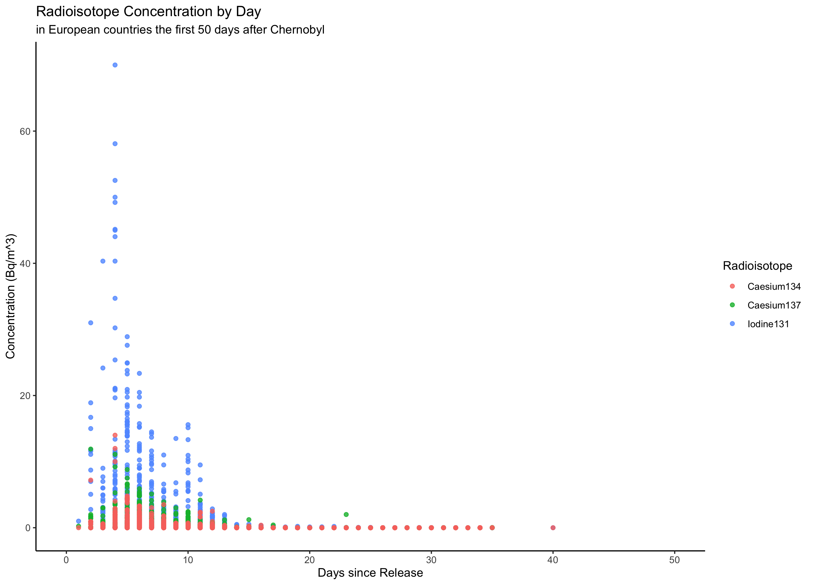
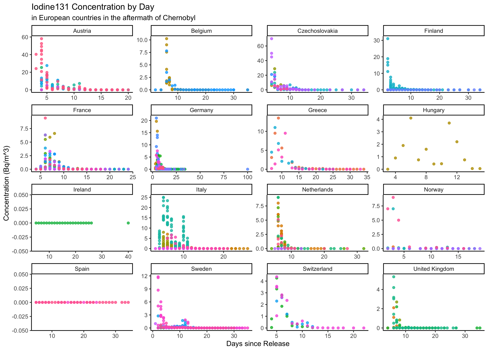
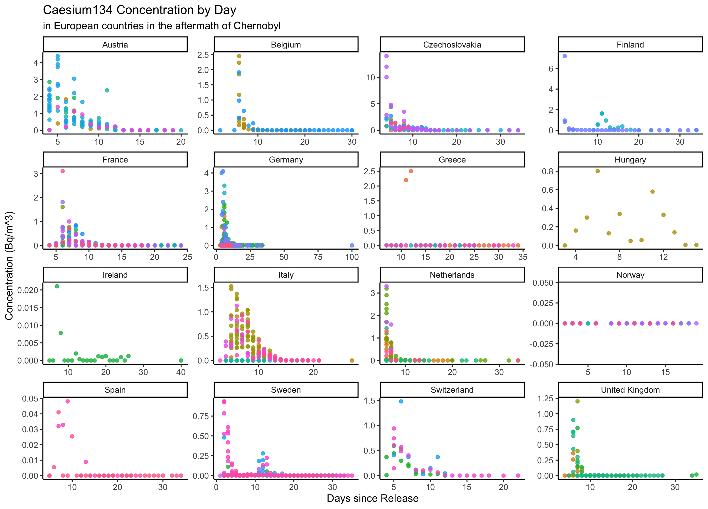
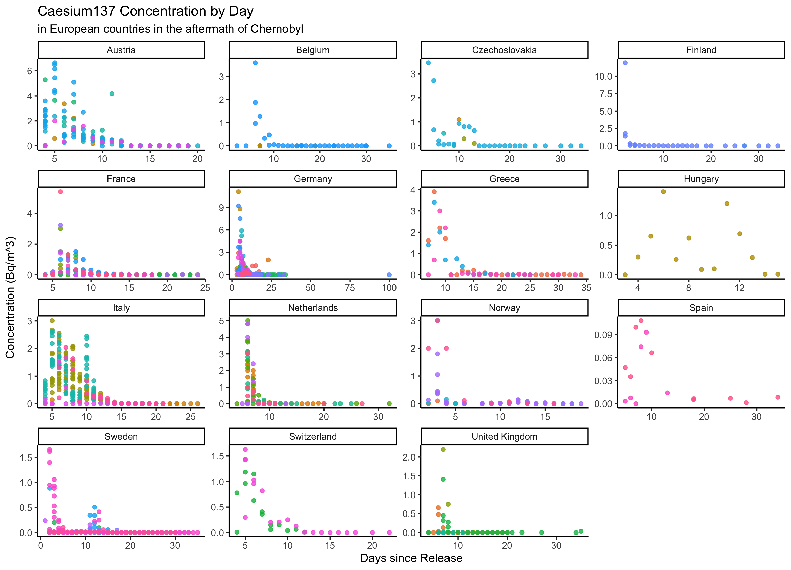

# Summary/Abstract
_Write a summary of your project._

# Introduction 

## General Background Information
_Provide enough background on your topic that others can understand the why and how of your analysis_ 
On April 26, 1989, a power failure at the number 4 reactor at the Chernobyl Nuclear Power Plant in the Soviet Union caused the worst nuclear disaster in history, resulting in an estimated $68 billion (adjusted for inflation) of damages. Due to the unprecedented nature of the event and the delay in notification of the general public, many questions still remain regarding the concentration and distribution of fallout radiation across several countries. As the controversy surrounding the true impact of the event remains even more than thirty years later, this study aims to better understand the distribution of the different radioisotopes from a nuclear reactor meltdown.

## Description of data and data source
_Describe what the data is, what it contains, where it is from, etc. Eventually this might be part of a methods section._
A publicly available dataset identifying sampling locations from across several European countries can be accessed [here](https://www.kaggle.com/brsdincer/chernobyl-chemical-radiation-csv-country-data).

There are nine variables included: country abbreviation, country numerical code, sampling location (city or state), latitude of sampling location, longitude of sampling location, date of sampling, and concentration of three radioisotopes (Iodine 131, Caesium 134, and Ceasium 137). There are 2051 observations included, but not all observations have complete data.

## Questions/Hypotheses to be addressed
_State the research questions you plan to answer with this analysis._
There are three primary questions this study will endeavor to answer:

1. Is there a significant reduction in radioisotope concentration captured within the study period? If so, do the results represent known half-life decomposition for each radioisotope type?

2. What is the geospatial dispersion of fallout radiation captured through this publicly available sampling dataset? 

3. Does the geospatial dispersion reported in the dataset match commonly accepted models for nuclear reactor meltdown? (Pending approval)

# Methods and Results

_In most research papers, results and methods are separate. You can combine them here if you find it easier. You are also welcome to structure things such that those are separate sections._


## Data import and cleaning
_Write code that reads in the file and cleans it so it's ready for analysis. Since this will be fairly long code for most datasets, it might be a good idea to have it in one or several R scripts. If that is the case, explain here briefly what kind of cleaning/processing you do, and provide more details and well documented code somewhere (e.g. as supplement in a paper). All materials, including files that contain code, should be commented well so everyone can follow along._
The raw data was obtained from [this online repository](https://www.kaggle.com/brsdincer/chernobyl-chemical-radiation-csv-country-data), but it is unclear from where the original poster obtained this data. The data were then imported into [RStudio 4.1](https://www.rstudio.com/), and the [tidyverse](https://www.tidyverse.org/) package was used to adjust variable formats and create subsets for future analyses. In lieu of using the calendar date for the sample collection, a new variable representing the number of days since the Chernobyl meltdown was created. This decision was motivated by the fact that radioactive decay is a relative measure of elapsed time rather than a calendar date. The [geosphere](https://cran.r-project.org/web/packages/geosphere/geosphere.pdf) package was used in a different feature engineering application to determine the distance between the Chernobyl nuclear power plant and each of the sampling locations. The full R code for data import and cleaning is available in the supplementary information.

## Exploratory analysis

_Use a combination of text/tables/figures to explore and describe your data. You should produce plots or tables or other summary quantities for the most interesting/important quantities in your data. Depending on the total number of variables in your dataset, explore all or some of the others. FIgures produced here might be histograms or density plots, correlation plots, etc. Tables might summarize your data._

_Continue by creating plots or tables of the outcome(s) of interest and the predictor/exposure/input variables you are most interested in. If your dataset is small, you can do that for all variables. Plots produced here can be scatterplots, boxplots, violinplots, etc. Tables can be simple 2x2 tables or larger ones._

_To get some further insight into your data, if reasonable you could compute simple statistics (e.g. t-tests, simple regression model with 1 predictor, etc.) to look for associations between your outcome(s) and each individual predictor variable. Though note that unless you pre-specified the outcome and main exposure, any "p<0.05 means statistical significance" interpretation is not valid._

A total 2,051 observations were included in the original dataset, but 20 were removed for having no concentration recorded for any of the radioisotopes in question. 

Table \@ref(tab:isotope_table) describes the three radioisotopes captured in the data.

```{r isotopetable,  echo=FALSE}
#load data for entire document
#path to data
#note the use of the here() package and not absolute paths
data_location <- here::here("data","processed_data","processeddata.rds")
data_location2 <- here::here("data", "processed_data", "processeddatalong.rds")

#load data
mydata <- readRDS(data_location)
mydata_long <- readRDS(data_location2)

#define row labels
table1::label(mydata$Iodine131) <- "Iodine 131 (Bq/m^3)"
table1::label(mydata$Caesium134) <- "Caesium 134 (Bq/m^3)"
table1::label(mydata$Caesium137) <- "Caesium 137 (Bq/m^3)"

#now combine into table
table1::table1(~ Iodine131 + Caesium134 + Caesium137, data = mydata)
```


Figure \@ref(fig:radioisotopesdays_50) depicts the relationship between the first 50 days after the incident and the measured concentration of each of the three radioisotopes. Radioactive decay is often used as an example of exponential decay; however, this pattern is not represented with this data. This phenomenon can be explained by the fact that fallout radiation instead follows a Poisson distribution pattern, due to the geographical dispersion of the particles.

```{r radioisotopesdays_50,  fig.cap='Radioisotope concentrations in European countries by days after Chernobyl..', echo=FALSE}

```
Fallout radioisotope concentrations were collected from 96 different locations across 96 countries.

Figure \@ref(fig:i131samplelocations) depicts the relationship between time elapsed and the measured concentration of I-131 across the different countries. Figures \@ref(fig:cs134samplelocations) and \@ref(fig:cs137samplelocations) are identical representations but for Cs-134 and Cs-137 respectively.

```{r i131locations,  fig.cap='Concentration of I-131 in European countries by days after Chernobyl.', echo=FALSE}

```

```{r cs134locations,  fig.cap='Concentration of Cs-134 in European countries by days after Chernobyl.', echo=FALSE}

```

```{r cs137locations,  fig.cap='Concentration of Cs-137 in European countries by days after Chernobyl.', echo=FALSE}

```

## Full analysis

_Use one or several suitable statistical/machine learning methods to analyze your data and to produce meaningful figures, tables, etc. This might again be code that is best placed in one or several separate R scripts that need to be well documented. You want the code to produce figures and data ready for display as tables, and save those. Then you load them here._


# Discussion

## Summary and Interpretation
_Summarize what you did, what you found and what it means._

## Strengths and Limitations
_Discuss what you perceive as strengths and limitations of your analysis._

## Conclusions
_What are the main take-home messages?_

_Include citations in your Rmd file using bibtex, the list of references will automatically be placed at the end_

This paper [@Leek2015a] discusses types of analyses. 

Note that this cited reference will show up at the end of the document, the reference formatting is determined by the CSL file specified in the YAML header. Many more style files for almost any journal [are available](https://www.zotero.org/styles). You also specify the location of your bibtex reference file in the YAML. You can call your reference file anything you like, I just used the generic word `references.bib` but giving it a more descriptive name is probably better.


# References


