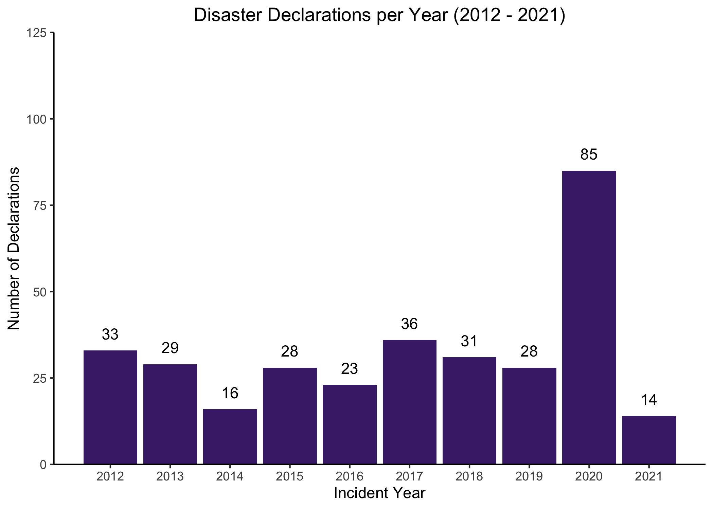
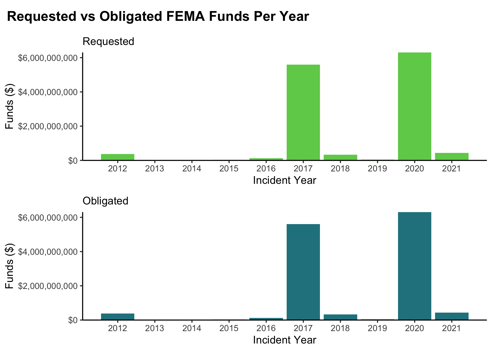
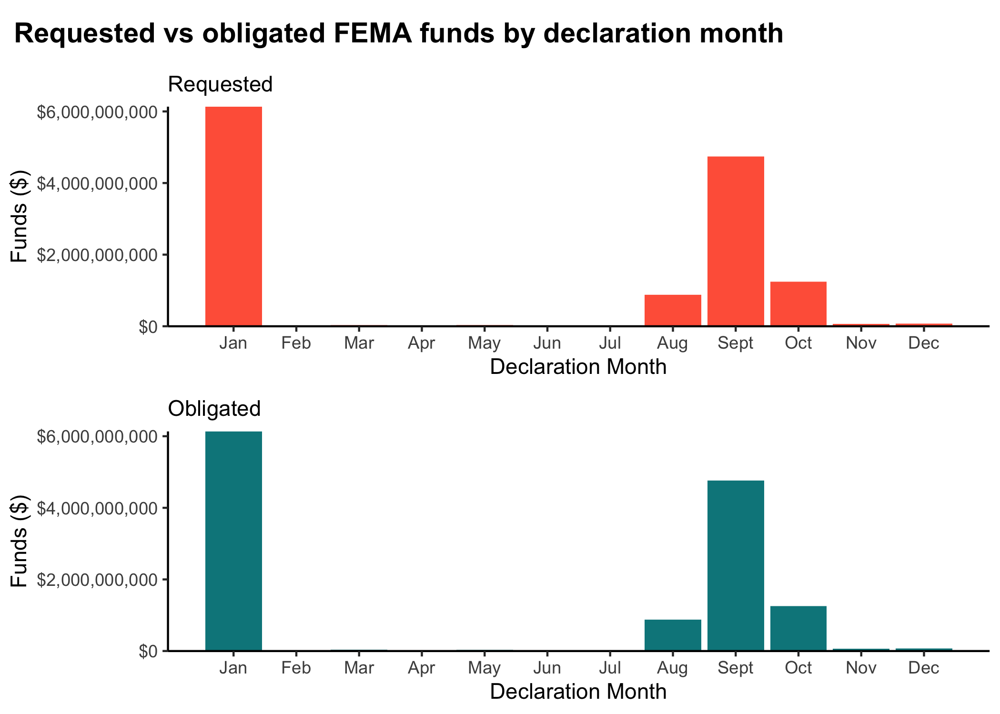
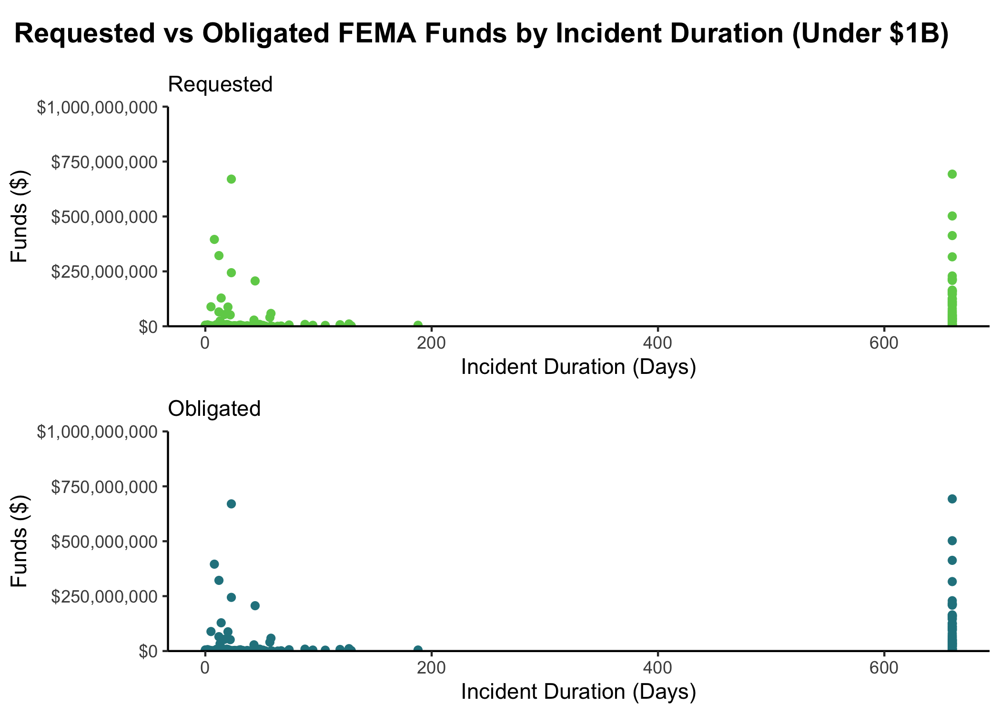
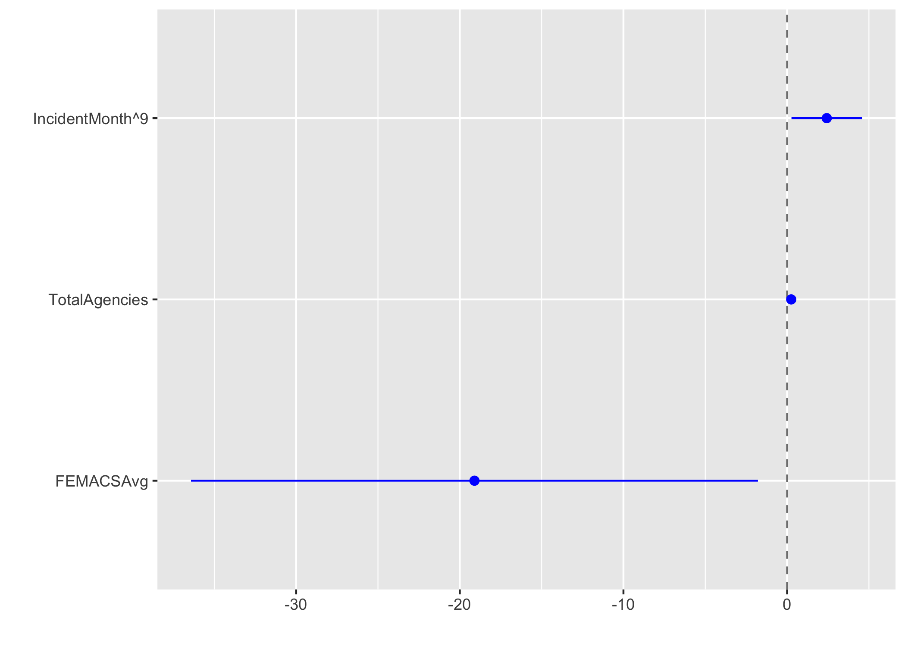
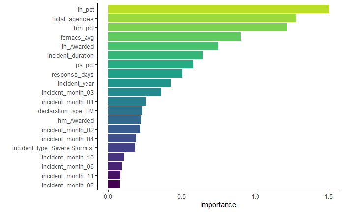
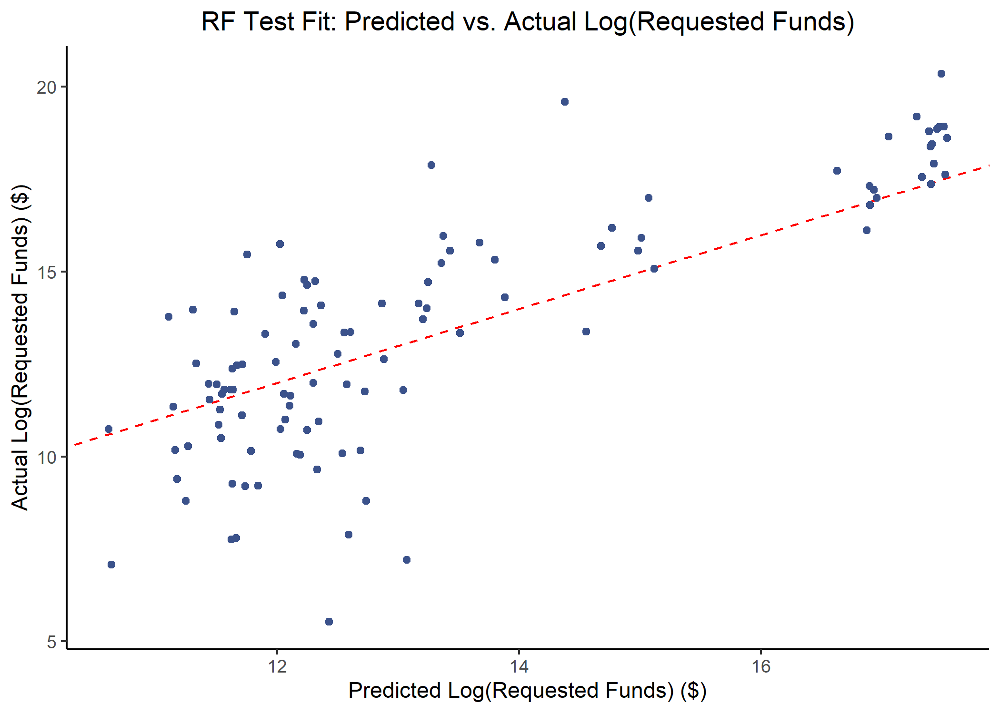

# Supplemental Information
This document represents additional information about the data and results. The full code and detailed explanation of the figures can be found at the [GitHub repository](https://github.com/morganataylor/MorganTaylor-MADA-project).

## Exploratory analysis
The processed data were explored to characterize and summarize the relevant features, which can be found below.

Table \@ref(tab:table1) reflects the results of the exploratory data analysis. Between February 2012 and November 2021, there were 446 disaster declarations for states and territories. Funds requested by states or territories for FEMA ranged from -\$855,200.3 to \$4,388,540,486, with an average of \$29,673,687, and FEMA funds obligated to the states and territories after reconciliation ranged from -\$855,200.3 to \$440,842,4297 with an average of \$29,744,109. 

```{r summarytable,  echo=FALSE, message = FALSE}
readRDS("../../results/table1.rds")
```

Figure \@ref(fig:map1) shows the FEMA Regions by state.
```{r map1,  fig.cap='FEMA Regions', echo=FALSE, message = FALSE}

```


Figure \@ref(fig:incidentyears) shows the number of disaster declarations per year, and Figure \@ref(fig:funds-years) shows the total FEMA funds (both requested and obligated) by states per year. The substantial peak in 2020 corresponds to the COVID-19 pandemic, and the one in 2017 represents the hurricane season with Hurricanes Irma, Harvey, and Maria. These characteristics can also be seen in Table \@ref(tab:decs-year-3), which represents FEMA Funding for the 3 Costliest Years (2012 - 2021).

```{r incidentyears,  fig.cap='Number of disaster declarations per year 2012 - 2021', echo=FALSE, message = FALSE}

```

```{r funds-years,  fig.cap='State or territory requested FEMA funds and obligated FEMA funds by year 2012 - 2021', echo=FALSE, message = FALSE}

```

```{r decs-year-3,  echo=FALSE, message = FALSE}
readRDS("../../results/decs-year-3.Rds")
```


Figure \@ref(fig:incidentmonth) shows the number of disaster declarations per month, and Figure \@ref(fig:funds-month) shows the total FEMA funds (both requested and obligated) by states per month. The substantial peak in January likely corresponds to the COVID-19 pandemic, and the ones in August, September, and October represent the peak hurricane season. These characteristics can also be seen in Table \@ref(tab:decs-month-3), which represents FEMA Funding for the 3 Costliest Months.

```{r incidentmonth,  fig.cap='Number of disaster declarations per month for years 2012 - 2021', echo=FALSE}
knitr::include_graphics("../../results/incidentmonth.png")
```

```{r funds-month,  fig.cap='State or territory requested FEMA funds and obligated FEMA funds by month for 2012 - 2021', echo=FALSE}

```

```{r decs-month-3,  echo=FALSE, message = FALSE}
readRDS("../../results/decs-month-3.Rds")
```

All 50 states as well as Washington, DC were included in the final, combined dataset. Table \@ref(tab:decs-state-5) provides the five most disaster-prone states and summarizes their requested FEMA funding and received FEMA funding over the study period.
```{r decs-state-5,  echo=FALSE, message = FALSE}
readRDS("../../results/decs-state-5.Rds")
```

Incident duration ranged from zero days to 660 days (or almost two years), as seen by Figure \@ref(fig:funds-dur). The incident duration of 660 days likely corresponds to the COVID-19 pandemic, which is an ongoing incident of almost two years. Further analysis of all variables can be found in the supplementary information.

```{r funds-dur,  fig.cap='Incident duration for requested FEMA funds and obligated FEMA funds under $1 billion for 2012 - 2021', echo=FALSE}

```

## Modeling Analysis

Prior to fitting the data to machine learning models, standard simple and multivariable regression models were fitted using the tidymodels framework in RStudio 4.1. Both outcomes of interest were fitted, using incident duration as the primary predictor of interest. Figure \@ref(fig:req_MVR_bp) and \@ref(fig:obl_MVR_bp) show the significant variables fitted in the multivariable regression models for requested and obligated FEMA funds, respectively. There are simply too many variables to be able to report all variables on one figure.

```{r req_MVR_bp,  fig.cap='Significant predictors in multivariate regression model for requested FEMA funds', echo=FALSE}

```

```{r obl_MVR_bp,  fig.cap='Significant predictors in multivariate regression model for obligated FEMA funds', echo=FALSE}
knitr::include_graphics("../../results/obl_MVR_bp.png")
```

Table \@ref(tab:lm-eval) shows the comparisons of the models, using the root mean square error (RMSE) and r-squared statistics. The requested and obligated funding models performed almost identically. None of the models fit the data well, which suggests more sophisticated modeling practices are necessary to adequately characterize the data.

```{r lm-eval,  echo=FALSE, message = FALSE}
resulttable2=readRDS("../../results/lm-eval.rds")
knitr::kable(resulttable2, caption = 'Linear model comparisons')
```


## Machine Learning Models

The identified decision tree model for each outcome is illustrated by Figures  \@ref(fig:DT-plot-outlier) and  \@ref(fig:DT-plot-OA-outlier).

```{r DT-plot-outlier,  fig.cap='Selected decision tree for predicting requested FEMA funds', echo=FALSE}

```

```{r DT-plot-OA-outlier,  fig.cap='Selected decision tree for predicting obligated FEMA funds', echo=FALSE}

```

The most important variables in the identified random forest model for each outcome is illustrated by Figures  \@ref(fig:RF-plot-outlier) and  \@ref(fig:RF-plot-OA-outlier).

```{r RF-plot-outlier,  fig.cap='20 most important variables for the random forest model for requested FEMA funds', echo=FALSE}

```

```{r RF-plot-OA-outlier,  fig.cap='20 most important variables for the random forest model for obligated FEMA funds', echo=FALSE}

```

The most important variables in the identified elastic net model for each outcome is illustrated by Figures  \@ref(fig:EN-plot-outlier) and  \@ref(fig:EN-plot-OA-outlier).

```{r EN-plot-outlier,  fig.cap='20 most important variables for the elastic net model for requested FEMA funds', echo=FALSE}

```

```{r EN-plot-OA-outlier,  fig.cap='20 most important variables for the elastic net model for obligated FEMA funds', echo=FALSE}

```

The most important variables in the identified LASSO model for each outcome is illustrated by Figures  \@ref(fig:LASSO-plot-outlier) and  \@ref(fig:LASSO-plot-OA-outlier).

```{r LASSO-plot-outlier,  fig.cap='20 most important variables for the LASSO model for requested FEMA funds', echo=FALSE}

```

```{r LASSO-plot-OA-outlier,  fig.cap='20 most important variables for the LASSO model for obligated FEMA funds', echo=FALSE}

```


Table \@ref(tab:ML-model-comp) shows the model comparisons for estimating requested FEMA funding, and Table \@ref(tab:ML-model-comp-obl) similarly shows the model comparisons for estimating obligated FEMA funding.

```{r ML-model-comp,  echo=FALSE, message = FALSE}
resulttable=readRDS("../../results/ML-model-comp.rds")
knitr::kable(resulttable, caption = 'ML model comparison for requested FEMA funding')
```

```{r ML-model-comp-obl,  echo=FALSE}
resulttable1=readRDS("../../results/ML-model-comp-OA.rds")
knitr::kable(resulttable1, caption = 'ML model comparison for obligated FEMA funding')
```

Once the random forest was fit to the test data, the following diagnostic plots were created for each outcome.

For Requested FEMA Funding:
```{r RF-pred-act-test-outlier,  fig.cap='Actual vs predicted log(requested FEMA funds) for the random forest test model', echo=FALSE}

```

```{r RF-resid-test-outlier,  fig.cap='Requested FEMA funds residuals for the random forest test model', echo=FALSE}

```

```{r RF-pred-resid-test-outlier,  fig.cap='Residuals versus fitted values of the log(requested FEMA funds) for the random forest test model', echo=FALSE}

```

For Obligated FEMA Funding:

```{r RF-pred-act-test-OA-outlier,  fig.cap='Actual vs predicted log(obligated FEMA funds) for the random forest test model', echo=FALSE}

```

```{r RF-resid-test-OA-outlier,  fig.cap='Obligated FEMA funds residuals for the random forest test model', echo=FALSE}

```

```{r RF-pred-resid-test-OA-outlier,  fig.cap='Residuals versus fitted values of the log(obligated FEMA funds) for the random forest test model', echo=FALSE}

```

