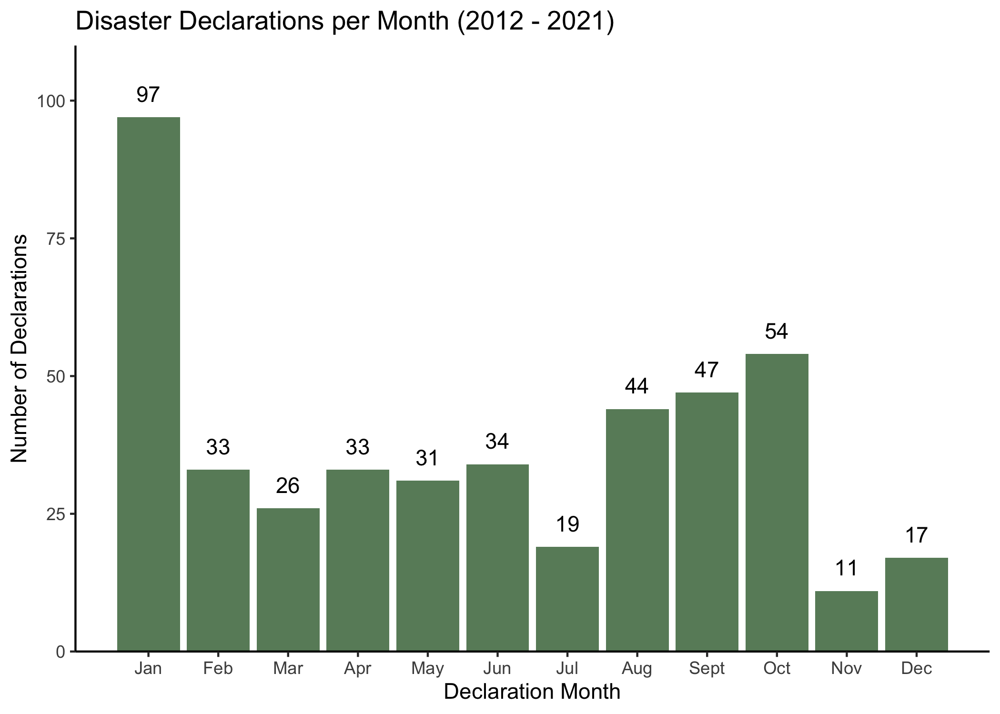
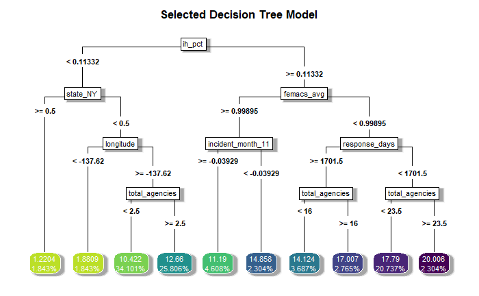
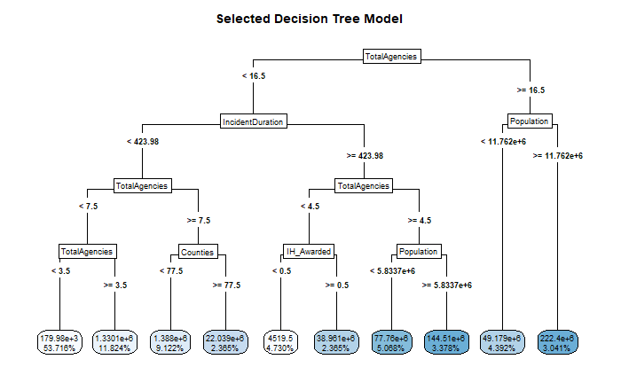
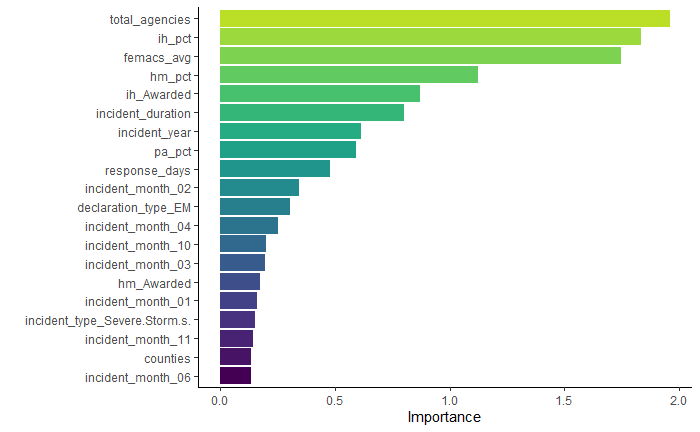
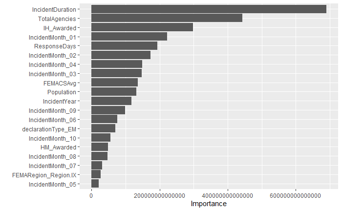
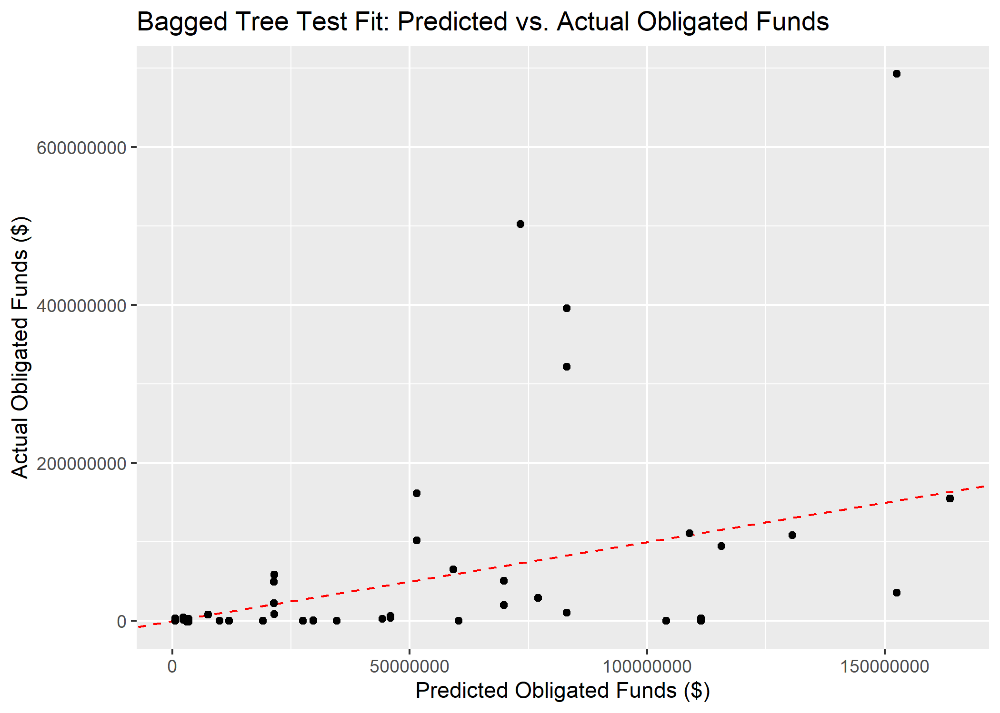

# Supplemental Information
This document represents additional information about the data and results.

## Exploratory analysis
The processed data were then explored to characterize and summarize the relevant features in RStudio 4.1 with the following packages: here, tidyverse, skimr, summarytools, ggplot2, car, gtsummary, scales, cowplot, and table1. The supplementary files contain the code that generates the following results.


Table \@ref(tab:table1) reflects the results of the exploratory data analysis. Between February 2012 and November 2021, there were 446 disaster declarations for states and territories. Funds requested by states or territories for FEMA ranged from -\$855,200.3 to \$4,388,540,486, with an average of \$29,673,687, and FEMA funds obligated to the states and territories after reconciliation ranged from -\$855,200.3 to \$440,842,4297 with an average of \$29,744,109. 

```{r summarytable,  echo=FALSE, message = FALSE}
readRDS("../../results/table1.rds")
```


Figure \@ref(fig:incidentyears) shows the number of disaster declarations per year, and Figure \@ref(fig:funds-years) shows the total FEMA funds (both requested and obligated) by states per year. The substantial peak in 2020 corresponds to the COVID-19 pandemic, and the one in 2017 represents the hurricane season with Hurricanes Irma, Harvey, and Maria. These characteristics can also be seen in Table \@ref(tab:decs-year-3), which represents FEMA Funding for the 3 Costliest Years (2012 - 2021).

```{r incidentyears,  fig.cap='Number of disaster declarations per year 2012 - 2021', echo=FALSE, message = FALSE}
knitr::include_graphics("../../results/incidentyear.png")
```

```{r funds-years,  fig.cap='State or territory requested FEMA funds and obligated FEMA funds by year 2012 - 2021', echo=FALSE, message = FALSE}
knitr::include_graphics("../../results/funds-years.png")
```

```{r decs-year-3,  echo=FALSE, message = FALSE}
readRDS("../../results/decs-year-3.Rds")
```


Figure \@ref(fig:incidentmonth) shows the number of disaster declarations per month, and Figure \@ref(fig:funds-month) shows the total FEMA funds (both requested and obligated) by states per month. The substantial peak in January likely corresponds to the COVID-19 pandemic, and the ones in August, September, and October represent the peak hurricane season. These characteristics can also be seen in Table \@ref(tab:decs-month-3), which represents FEMA Funding for the 3 Costliest Months.

```{r incidentmonth,  fig.cap='Number of disaster declarations per month for years 2012 - 2021', echo=FALSE}

```

```{r funds-month,  fig.cap='State or territory requested FEMA funds and obligated FEMA funds by month for 2012 - 2021', echo=FALSE}
knitr::include_graphics("../../results/funds-month.png")
```

```{r decs-month-3,  echo=FALSE, message = FALSE}
readRDS("../../results/decs-month-3.Rds")
```

All 50 states as well as Washington, DC were included in the final, combined dataset. Table \@ref(tab:decs-state-5) provides the five most disaster-prone states and summarizes their requested FEMA funding and received FEMA funding over the study period.
```{r decs-state-5,  echo=FALSE, message = FALSE}
readRDS("../../results/decs-state-5.Rds")
```

Incident duration ranged from zero days to 660 days (or almost two years), as seen by Figure \@ref(fig:funds-dur). The incident duration of 660 days likely corresponds to the COVID-19 pandemic, which is an ongoing incident of almost two years. Further analysis of all variables can be found in the supplementary information.

```{r funds-dur,  fig.cap='Incident duration for requested FEMA funds and obligated FEMA funds under $1 billion for 2012 - 2021', echo=FALSE}
knitr::include_graphics("../../results/funds-dur.png")
```

Prior to fitting the data to machine learning models, standard simple and multivariable regression models were fitted using the tidymodels framework in RStudio 4.1. Both outcomes of interest were fitted, using incident duration as the primary predictor of interest. Figure \@ref(fig:req_MVR_bp) and \@ref(fig:obl_MVR_bp) show the significant variables fitted in the multivariable regression models for requested and obligated FEMA funds, respectively.

```{r req_MVR_bp,  fig.cap='Significant predictors in multivariate regression model for requested FEMA funds', echo=FALSE}
knitr::include_graphics("../../results/req_MVR_bp.png")
```

```{r obl_MVR_bp,  fig.cap='Significant predictors in multivariate regression model for obligated FEMA funds', echo=FALSE}
knitr::include_graphics("../../results/obl_MVR_bp.png")
```


Table \@ref(tab:lm-eval) shows the comparisons of the models, using the root mean square error (RMSE) and r-squared statistics. The requested and obligated funding models performed almost identically. None of the models fit the data well, which suggests more sophisticated modeling practices are necessary to adequately characterize the data.

```{r lm-eval,  echo=FALSE, message = FALSE}
resulttable2=readRDS("../../results/lm-eval.rds")
knitr::kable(resulttable2, caption = 'Linear model comparisons')
```


## Full analysis

Three models were considered for the prediction analysis: decision tree, bagged tree, and random forest, and each were fit for both outcomes of interest (e.g. requested and obligated funds). Prior to fitting the models, the data were subset based on outcome of interest, and some feature engineering was performed. Due to the limited values in certain categories, the state variable was summarized into the ten FEMA regions and the least frequent disaster types were added to the "Other" category. The data were split such that 66.7% were used for training the models and the remaining 33.3% were used for testing the final chosen model, stratified by the incident type. Cross-validation was used for the decision tree and random forest models, using a five-fold, five-repeat resampling structure, also stratified by the incident type. The bagged tree model instead implemented a bootstrap resampling structure, repeated ten times, again stratified by the incident type. The models were then compared based on the root mean square error (RMSE), the standard metric for regression models. The analysis was completed in RStudio 4.1 with the following packages: here, tidyverse, tidymodels, skmir, broom.mixed, rpart.plot, vip, glmnet, doParallel, ranger, and baguette.

The identified decision tree model for each outcome is illustrated by Figures  \@ref(fig:DT-plot) and  \@ref(fig:DT-plot-obl). Both outcomes identified the same decision point features: total number of federal agencies involved in the response, duration of the incident, state population, state counties, and whether the individual / housing assistance program was awarded.

```{r DT-plot,  fig.cap='Selected decision tree for predicting requested FEMA funds', echo=FALSE}

```

```{r DT-plot-obl,  fig.cap='Selected decision tree for predicting obligated FEMA funds', echo=FALSE}

```

The most important variables in the identified random forest model for each outcome is illustrated by Figures  \@ref(fig:RF-plot) and  \@ref(fig:RF-plot-obl). Both outcomes identified the same important features: incident duration, total number of agencies involved, individual/housing assistance program awardance, and incident month. Interestingly, however, the obligated funds model includes days of the entire response as the fifth most important feature, whereas the requested funds model includes it as the eleventh most important feature. Unfortunately, the tidymodels framework does not support visualization of the bagged tree model.

```{r RF-plot,  fig.cap='20 most important variables for the random forest model for requested FEMA funds', echo=FALSE}

```

```{r RF-plot-obl,  fig.cap='20 most important variables for the random forest model for obligated FEMA funds', echo=FALSE}

```

Table \@ref(tab:ML-model-comp) shows the model comparisons for estimating requested FEMA funding, and Table \@ref(tab:ML-model-comp-obl) similarly shows the model comparisons for estimating obligated FEMA funding. In both outcomes, the bagged tree had the lowest RMSE; however, the standard error estimate of the RMSE was higher in the bagged tree models than for the other models.

```{r ML-model-comp,  echo=FALSE, message = FALSE}
resulttable=readRDS("../../results/ML-model-comp.rds")
knitr::kable(resulttable, caption = 'ML model comparison for requested FEMA funding')
```

```{r ML-model-comp-obl,  echo=FALSE}
resulttable1=readRDS("../../results/ML-model-comp-obl.rds")
knitr::kable(resulttable1, caption = 'ML model comparison for obligated FEMA funding')
```

The bagged tree model was still chosen as the best model of the three, and it was fitted to the testing data sample. The RMSEs for the testing and training datasets were substantially different. Figure \@ref(fig:BT-pred-act-test) shows the predicted and actual requested funds values, and Figure \@ref(fig:BT-pred-act-test-obl) does the same for obligated FEMA funds. The supplementary information contains the code for the models as well as all diagnostic plots.
```{r BT_pred_act_test,  fig.cap='Predicted vs actual requested FEMA funds for the bagged tree fit', echo=FALSE}
knitr::include_graphics("../../results/BT-pred-act-test.png")
```

```{r BT_pred_act_test-obl,  fig.cap='Predicted vs actual obligated FEMA funds for the bagged tree fit', echo=FALSE}

```

